# Panduan Dosen / Laboran: Mengelola Praktikum, Ujian, dan Penilaian

Panduan ini untuk dosen pengampu praktikum, laboran, dan admin lab yang memakai aplikasi
**Laboratorium**. Pengelolaan inventaris (barang, perbaikan, opname, pembelian) ada di
[Panduan Inventaris](panduan-inventaris.md).

Alur kerja praktikum secara singkat:

1. Siapkan data: prodi, mata kuliah, kelas, dan mahasiswa (sekali di awal semester), lalu buat
   akun portal mahasiswa.
2. Buat soal **pretest/posttest**.
3. Buat **sesi praktikum**, pilih soalnya, lalu buat **kelompok** dan masukkan mahasiswa.
4. Saat praktikum: klik **Generate Token** dan tampilkan token ke mahasiswa untuk presensi.
5. Setelah praktikum: periksa jawaban ujian dan berkas, isi **nilai**, lalu tandai kelompok
   **Sudah Praktikum**.
6. Lihat **laporan** nilai dan absensi.

---

## 1. Peran dan Hak Akses

| Peran | Untuk | Akses |
|---|---|---|
| **Lab: Admin / Laboran** | Laboran, dosen pengampu, admin lab | Semua fitur, termasuk inventaris dan pengadaan |
| **Lab: Manager (baca saja)** | Kaprodi, pimpinan | Melihat semua data dan laporan tanpa mengubah |

Cara admin Odoo memberi peran ke seorang dosen/laboran:

1. Buka **Settings > Users & Companies > Users**, lalu buka user dosen/laboran.
2. Pada tab **Access Rights**, bagian **EDUCATION**, isi **Laboratorium** dengan
   **Lab: Admin / Laboran** atau **Lab: Manager (baca saja)**.
3. Klik **Save** (ikon awan).

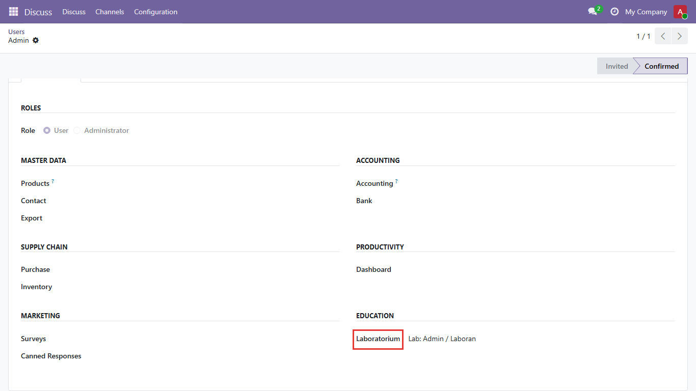

Setelah itu menu **Laboratorium** muncul di daftar aplikasi.

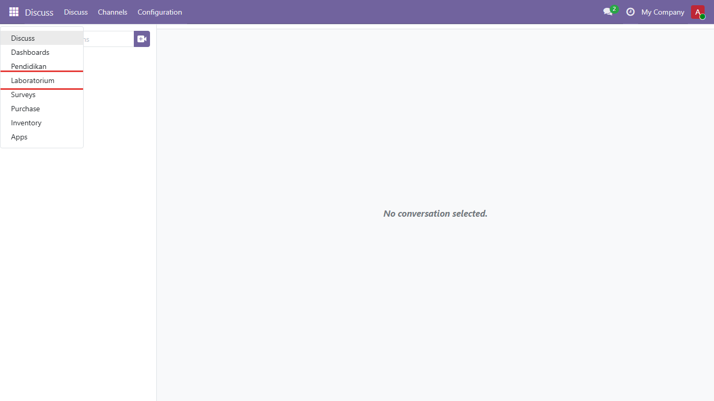

## 2. Menu Laboratorium

| Menu | Isi |
|---|---|
| **Praktikum** | Sesi Praktikum, Kelompok, Pretest / Posttest, Jawaban Ujian, Penilaian |
| **Mahasiswa** | Mahasiswa, Kelas, Mata Kuliah, Program Studi |
| **Inventaris** | Barang, Stok Menipis, Kategori, Perbaikan, Stock Opname |
| **Pengadaan** | Purchase Order, Penerimaan Barang, Supplier (khusus Admin / Laboran) |
| **Laporan** | Nilai Praktikum, Absensi, Penggunaan Bahan, Pembelian, Penyesuaian Stok |

Setiap daftar memiliki kotak pencarian, filter, dan pengelompokan (Group By) di tombol panah
sebelah kotak pencarian.

---

## 3. Data Akademik

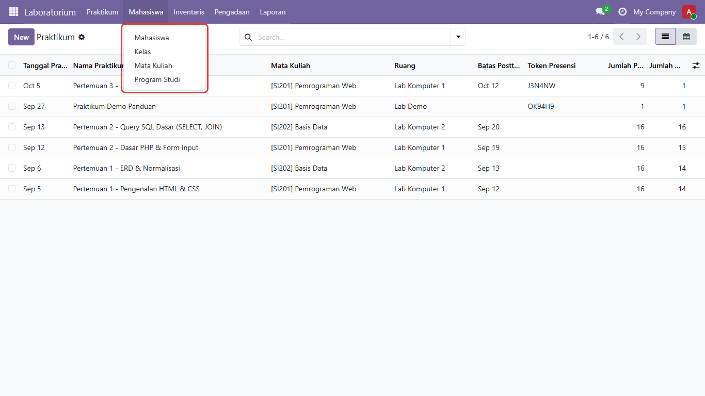

### Program Studi dan Mata Kuliah

**Mahasiswa > Program Studi** dan **Mahasiswa > Mata Kuliah** memakai data yang sama dengan modul
Pendidikan (kurikulum/RPS), jadi biasanya sudah terisi. Untuk laboratorium, program studi memiliki
isian tambahan **Gedung, Alamat, Telepon, Deskripsi**, dan mata kuliah memiliki
**Dosen Pengampu (Lab)**.

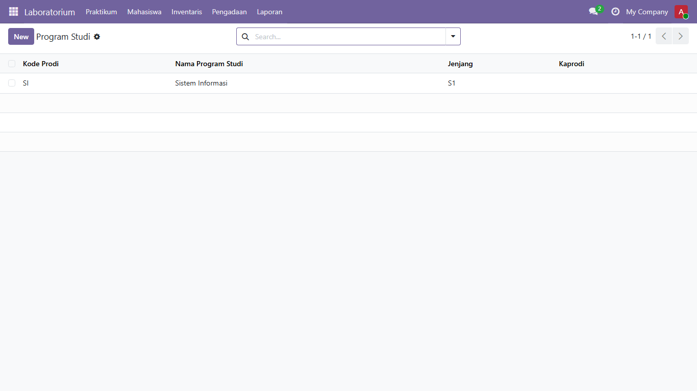

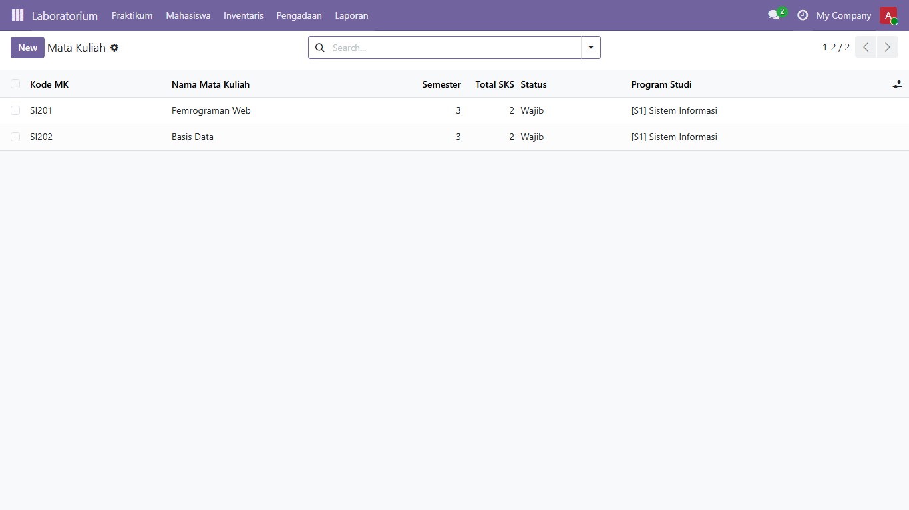

### Kelas

**Mahasiswa > Kelas** berisi rombongan belajar, misalnya *SI-A angkatan 2023*.

1. Klik **New**.
2. Isi **Nama Kelas**, **Kode Kelas** (harus unik), **Angkatan**, dan **Program Studi**.
3. Simpan. Daftar mahasiswa kelas tampil di form kelas.

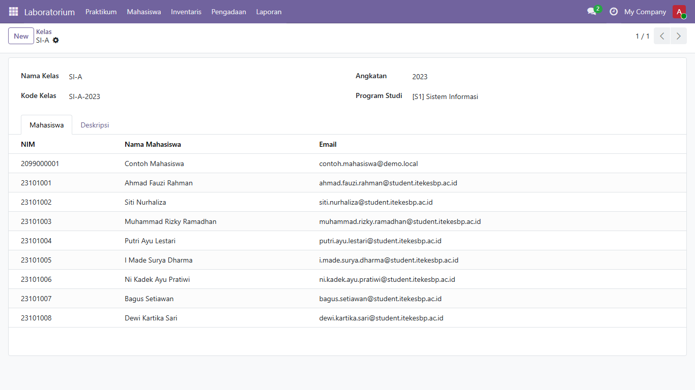

### Mahasiswa

**Mahasiswa > Mahasiswa** berisi data mahasiswa.

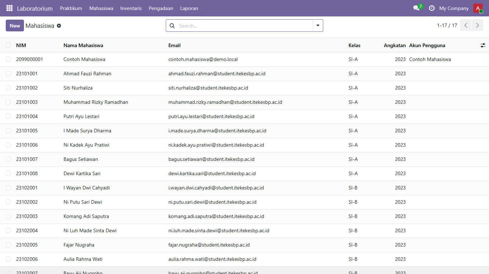

Kolom **Akun Pengguna** menunjukkan akun portal mahasiswa. Filter **Belum Punya Akun** menampilkan
mahasiswa yang belum bisa login.

Menambah mahasiswa:

1. Klik **New**.
2. Isi **Nama Mahasiswa**, **NIM** (unik), **Email** (unik, dipakai sebagai login), **Program Studi**,
   dan **Kelas**. Isian lain (telepon, alamat, tahun masuk, jenis kelamin, tanggal lahir, foto)
   bersifat opsional.
3. Simpan.

Tab **Riwayat Praktikum** menampilkan semua praktikum, presensi, dan nilai mahasiswa tersebut.

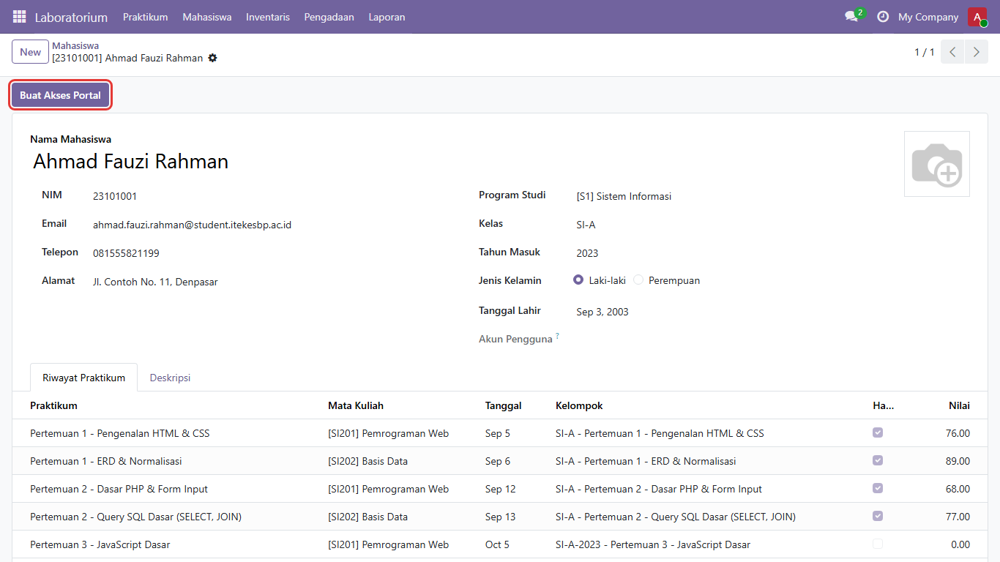

### Membuat Akun Portal Mahasiswa

- **Satu mahasiswa:** buka mahasiswa, klik **Buat Akses Portal**.
- **Banyak sekaligus:** di daftar mahasiswa, centang beberapa baris (atau filter
  **Belum Punya Akun** lalu centang semua), klik **Actions** (ikon roda gigi) >
  **Buat Akses Portal**.

Akun dibuat dengan login = email mahasiswa. Akun baru **belum punya password**. Admin mengaturnya
lewat **Settings > Users & Companies > Users**: hapus filter *Internal Users*, buka user mahasiswa,
buka tab **Security**, lalu klik **Change password**. Berikan password itu ke mahasiswa dan minta
mereka menggantinya (lihat [Panduan Mahasiswa](panduan-mahasiswa.md#mengganti-password)).

Jika akun dengan email yang sama sudah ada (misalnya dibuat manual), mahasiswa **otomatis
ditautkan** ke akun itu. Bila email mahasiswa diubah, tautan lama dilepas dan dicari ulang
berdasarkan email baru.

### Aturan Hapus Data

Untuk menjaga riwayat, data berikut tidak bisa dihapus selama masih dipakai:

| Data | Tidak bisa dihapus bila |
|---|---|
| Program studi | Masih punya kelas |
| Kelas | Masih punya mahasiswa |
| Mata kuliah | Sudah dipakai praktikum |
| Sesi praktikum | Sudah punya kelompok |
| Soal ujian | Masih dipakai praktikum |

Untuk mahasiswa yang sudah tidak aktif, gunakan **Actions > Archive** alih-alih hapus.

---

## 4. Membuat Soal Pretest / Posttest

Soal ujian memakai modul **Survey** Odoo. Buka **Praktikum > Pretest / Posttest**.

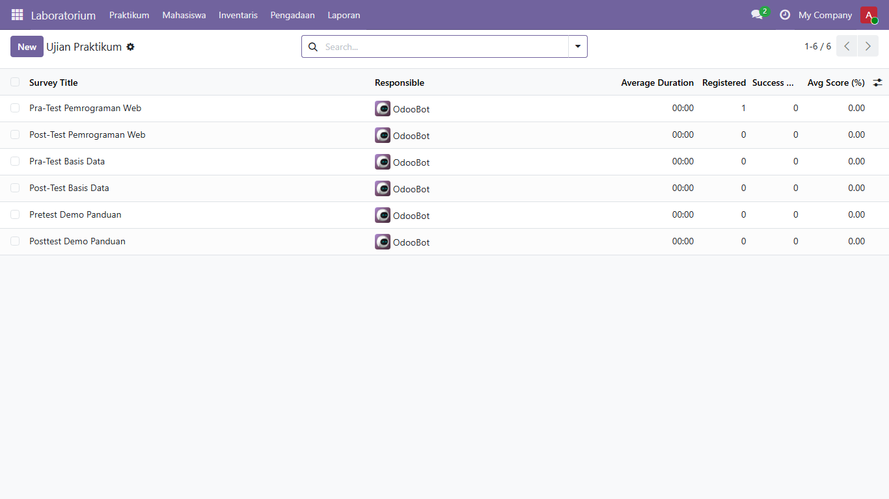

1. Klik **New**.
2. Isi judul, misalnya *Pretest Pemrograman Web - Pertemuan 3*.
3. Isi **Jenis Ujian Praktikum** (**Pretest** atau **Posttest**) dan **Mata Kuliah**.
4. Di tab **Questions**, klik **Add a question**:
   - Tulis pertanyaan.
   - Pilih **Question Type**. Untuk jawaban esai, gunakan **Multiple Lines Text Box**.
   - Buka tab **Kunci Jawaban** dan tulis kunci jawaban sebagai pegangan saat menilai.
     Kunci ini tidak terlihat oleh mahasiswa.
   - Klik **Save & Close**, atau **Save & New** untuk soal berikutnya.
5. Simpan survey.

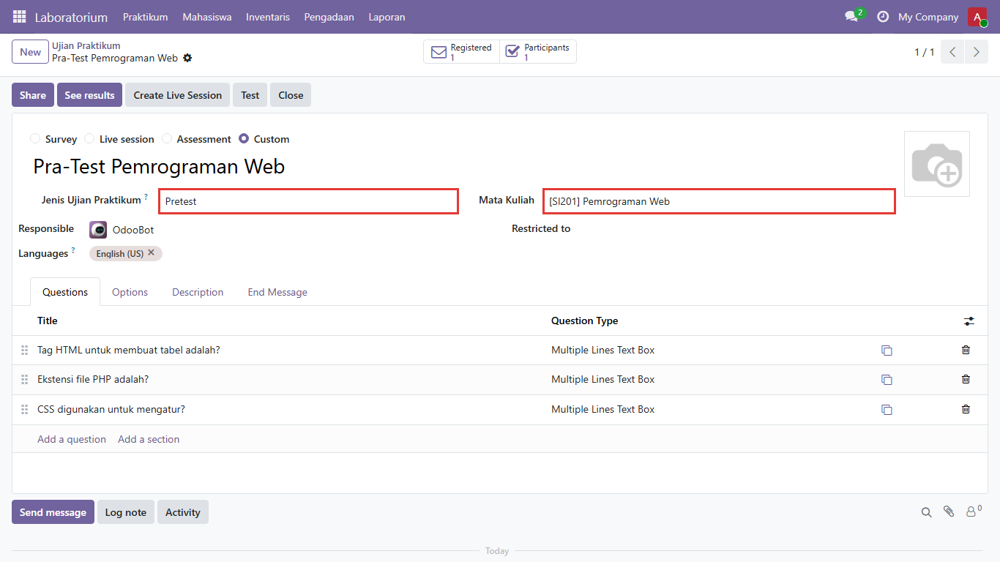

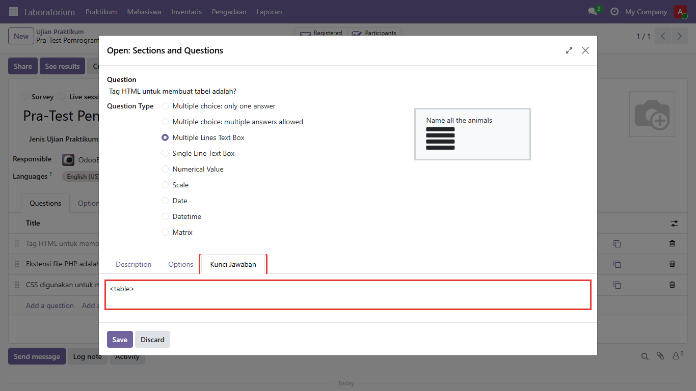

Catatan:

- Ujian yang dibuat dari menu ini otomatis diatur khusus praktikum: hanya bisa dibuka lewat
  halaman Praktikum mahasiswa, wajib login, semua soal dalam satu halaman, dan **tanpa skor
  otomatis** (dinilai manual).
- **Tidak perlu** memakai tombol **Share** survey. Mahasiswa membuka ujian dari halaman
  Praktikum mereka.
- Satu soal pretest/posttest bisa dipakai ulang di beberapa sesi praktikum.

---

## 5. Sesi Praktikum

Buka **Praktikum > Sesi Praktikum**.

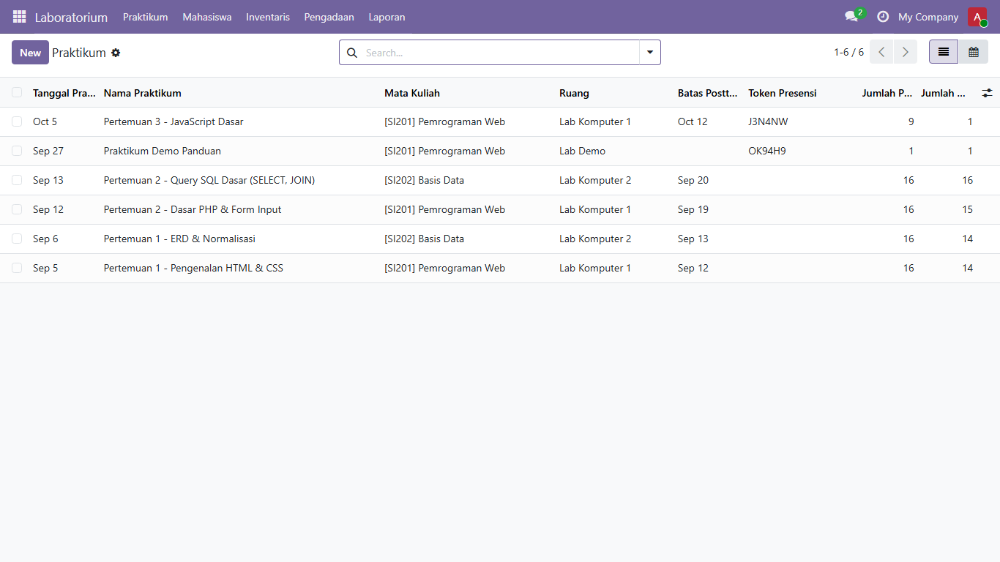

Klik ikon kalender di kanan atas untuk melihat jadwal per bulan.

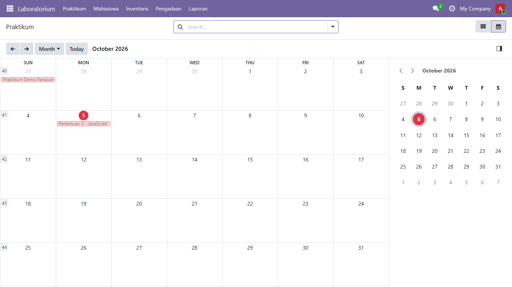

### Membuat Sesi

1. Klik **New**.
2. Isi:

   | Isian | Keterangan |
   |---|---|
   | Nama Praktikum | Misalnya *Pertemuan 3 - JavaScript Dasar* |
   | Mata Kuliah | Wajib |
   | Ruang | Misalnya *Lab Komputer 1* |
   | Tanggal Praktikum | Pretest bisa dikerjakan sampai akhir tanggal ini; posttest mulai tanggal ini |
   | Batas Posttest | Hari terakhir posttest. Kosongkan bila posttest tidak dibatasi |
   | Pretest / Posttest | Pilih soal dari bagian 4, atau ketik judul baru untuk membuatnya langsung |

3. Simpan.

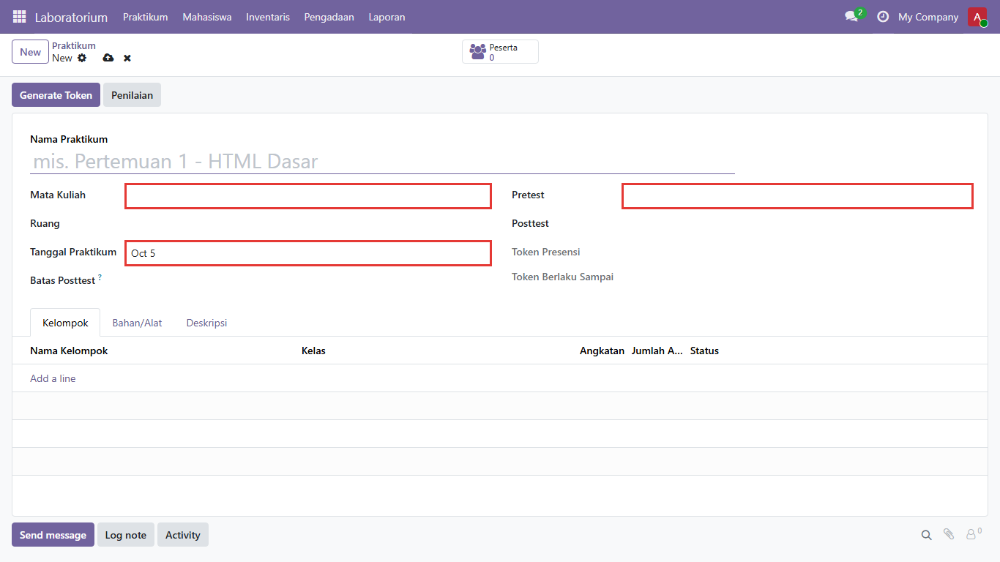

### Token Presensi

Saat praktikum dimulai, buka sesi praktikum lalu klik **Generate Token**. Token 6 karakter muncul
di **Token Presensi**, beserta jam berakhirnya di **Token Berlaku Sampai** (4 jam). Tampilkan token
ini di layar/proyektor, lalu mahasiswa memasukkannya di halaman Praktikum mereka.

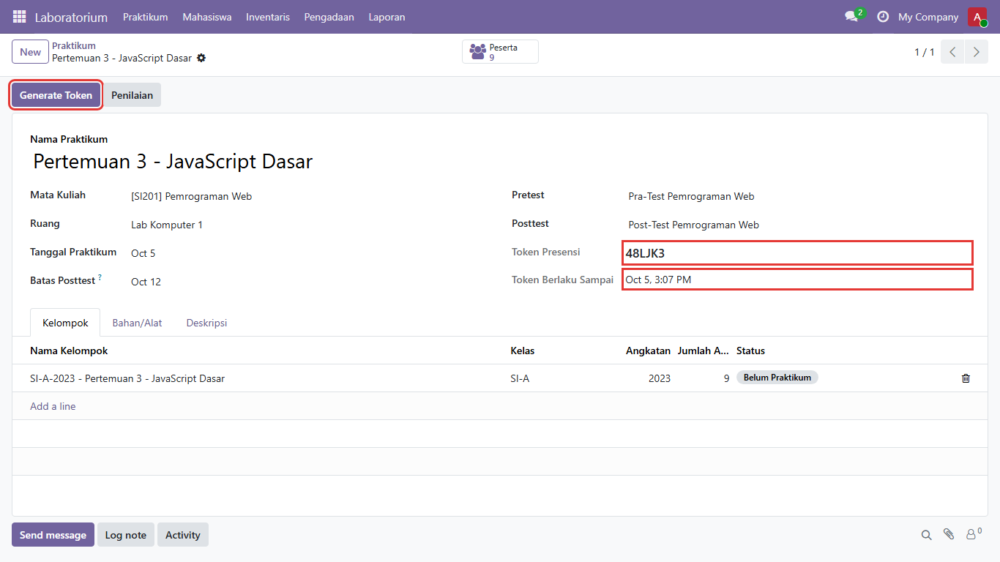

- Klik **Generate Token** lagi untuk membuat token baru. Token lama langsung tidak berlaku.
- Jumlah peserta tampil pada tombol **Peserta** di bagian atas form.

### Bahan/Alat

Tab **Bahan/Alat** mencatat barang yang dipakai **per kelompok** (barang dan jumlah). Data ini
dipakai di laporan Penggunaan Bahan dan **tidak** mengurangi stok.

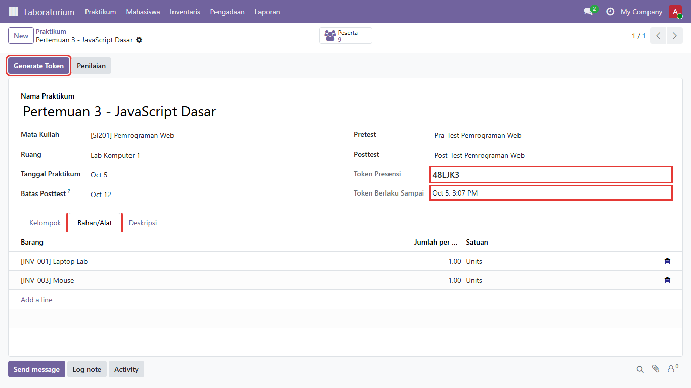

---

## 6. Kelompok dan Peserta

Mahasiswa hanya bisa presensi, mengerjakan ujian, dan mendapat nilai bila terdaftar di salah satu
**kelompok** sesi praktikum tersebut. Kelompok bisa ditambah dari tab **Kelompok** di form
praktikum, atau dari menu **Praktikum > Kelompok**.

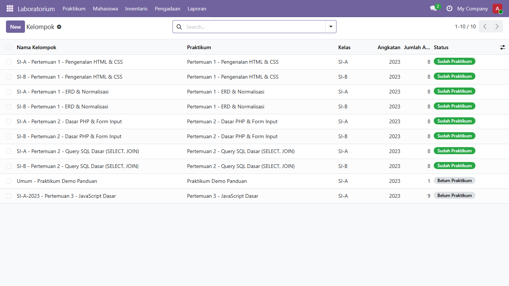

1. Klik **New**, isi **Nama Kelompok**, **Praktikum**, dan **Kelas**.
2. Klik **Tambah Semua Mahasiswa Kelas** untuk memasukkan semua mahasiswa kelas tersebut, atau
   tambah satu per satu lewat **Add a line** di tab **Anggota**.
3. Setelah praktikum selesai dan nilai lengkap, klik **Tandai Sudah Praktikum**. Data kelompok
   dan anggotanya terkunci. Untuk mengubah lagi, klik **Kembalikan ke Draft**.

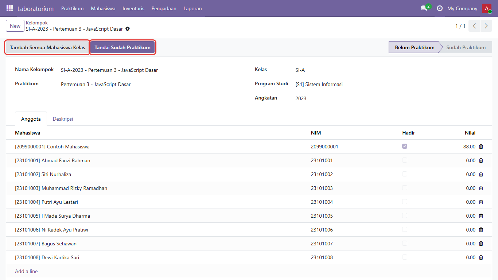

Satu mahasiswa hanya boleh masuk **satu kelompok** pada sesi praktikum yang sama.

---

## 7. Jawaban Ujian

**Praktikum > Jawaban Ujian** menampilkan semua jawaban pretest/posttest beserta praktikum,
mahasiswa, jenis ujian, dan status (**Completed** = sudah disubmit).

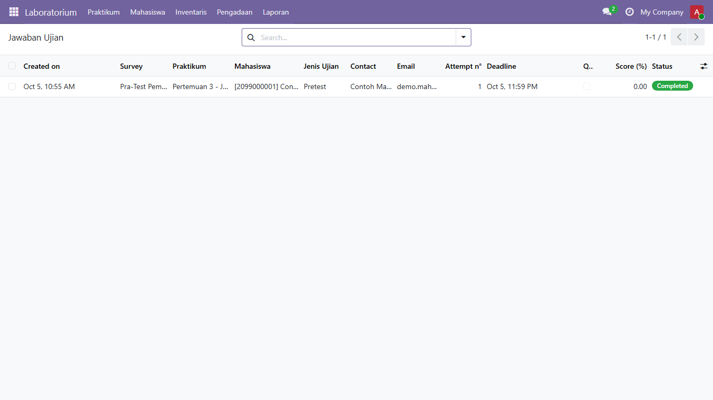

Klik satu baris untuk membaca jawaban per soal. Kolom *Score* selalu 0 karena ujian praktikum
dinilai manual.

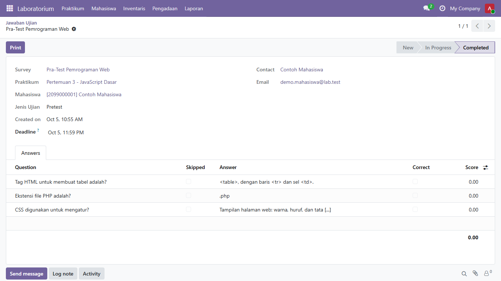

---

## 8. Penilaian

Buka sesi praktikum lalu klik **Penilaian** (atau menu **Praktikum > Penilaian**, yang
mengelompokkan peserta per praktikum).

1. Klik sel **Nilai** pada baris mahasiswa, ketik nilai **0–100**.
2. Klik **Save** (ikon awan) di atas daftar.

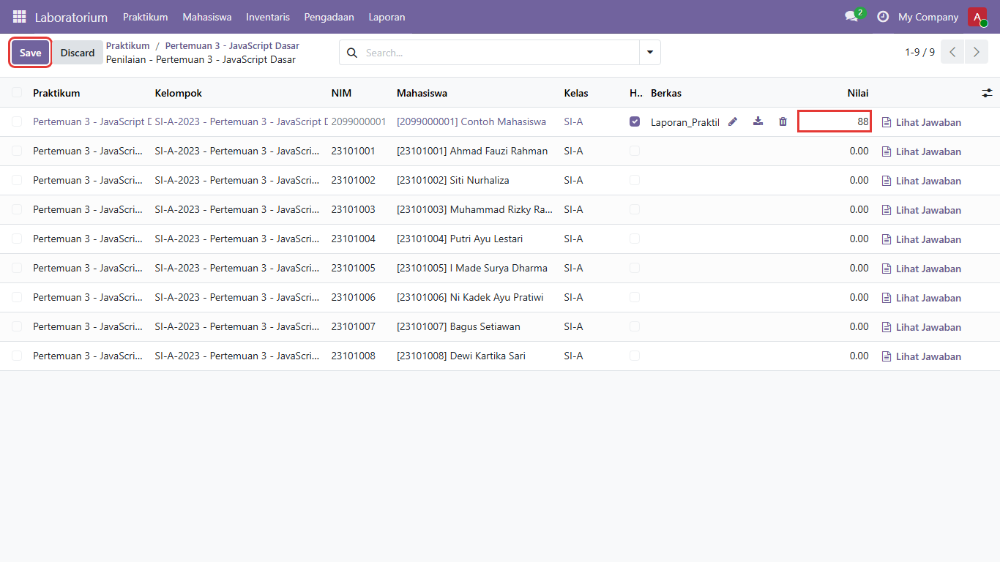

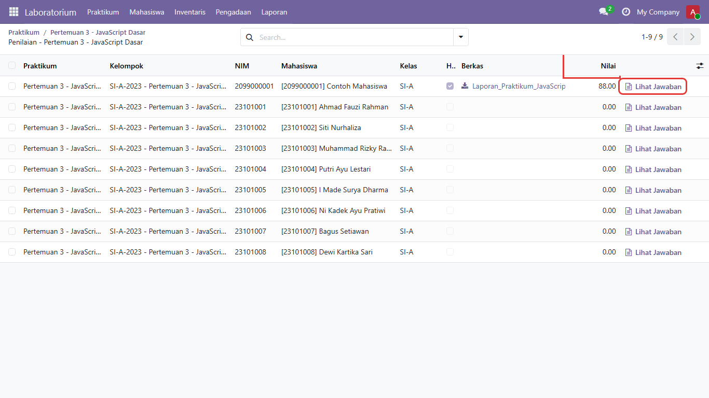

Pada grid yang sama:

| Kolom / Tombol | Fungsi |
|---|---|
| **Hadir** | Centang/hapus centang untuk mengoreksi presensi secara manual |
| **Berkas** | Unduh berkas laporan mahasiswa (klik nama file), atau upload atas nama mahasiswa |
| **Nilai** | Nilai praktikum, tampil di halaman Praktikum mahasiswa |
| **Lihat Jawaban** | Membuka jawaban pretest/posttest mahasiswa tersebut |

---

## 9. Laporan

### Nilai Praktikum

**Laporan > Nilai Praktikum** menampilkan tanggal, praktikum, mata kuliah, kelas, angkatan, NIM,
mahasiswa, kehadiran, dan nilai.

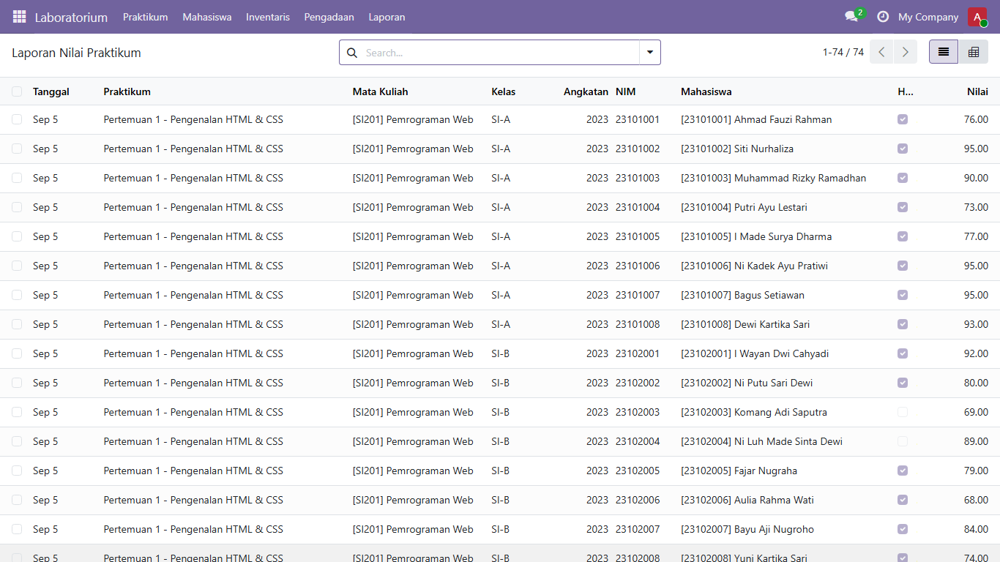

- Filter: **Hadir**, **Tidak Hadir**, **Tanggal**. Group By: **Praktikum**, **Kelas**, **Angkatan**.
- Klik ikon tabel (pivot) di kanan atas untuk melihat rata-rata nilai per praktikum dan kelas.
  Tombol unduh di pivot menghasilkan file Excel.

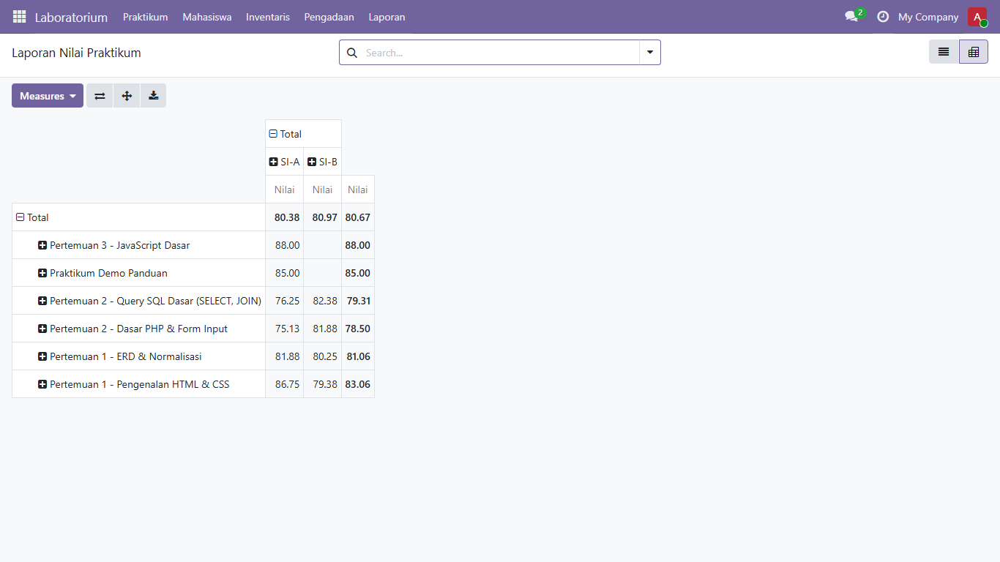

### Absensi

**Laporan > Absensi** memakai data yang sama, dikelompokkan per praktikum, untuk melihat jumlah
peserta dan siapa yang hadir/tidak hadir.

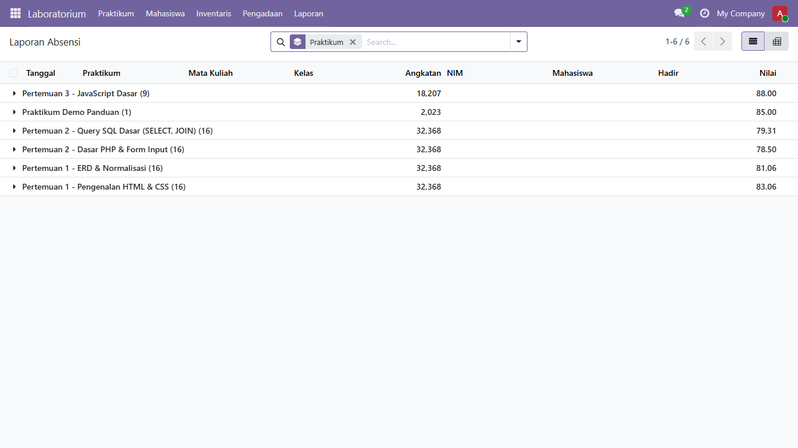

### Export ke Excel

Di tampilan daftar, centang baris yang diinginkan (atau centang kotak di judul kolom untuk memilih
semua), lalu **Actions > Export**.
