# Panduan Inventaris Laboratorium: Barang, Perbaikan, Stock Opname, dan Pengadaan

Panduan ini untuk laboran dan admin lab (peran **Lab: Admin / Laboran**). Pengguna dengan peran
**Lab: Manager (baca saja)** bisa melihat data dan laporan, tetapi tidak bisa mengubahnya.

Prinsip utama: **stok tidak diketik langsung**. Stok berubah hanya melalui:

| Kejadian | Pengaruh ke stok |
|---|---|
| Penerimaan barang dari Purchase Order | Stok bertambah |
| Perbaikan diproses | Stok tersedia berkurang (barang dipindah ke lokasi *Perbaikan Lab*) |
| Perbaikan selesai | Stok kembali bertambah |
| Stock opname divalidasi | Stok disamakan dengan hasil hitung fisik |

Pemakaian bahan di praktikum hanya dicatat untuk laporan dan **tidak** mengurangi stok.

---

## 1. Barang

Buka **Inventaris > Barang**.

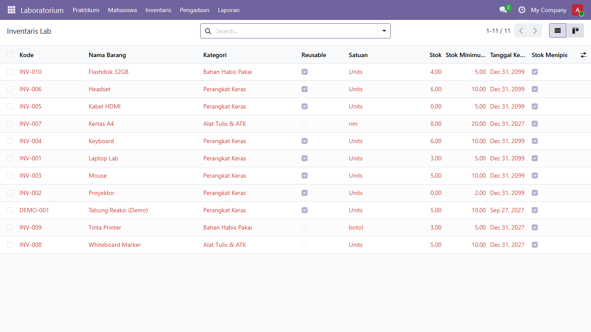

| Kolom | Keterangan |
|---|---|
| Kode | Kode barang, misalnya `INV-001` |
| Nama Barang, Kategori, Satuan | Identitas barang |
| Reusable | Tercentang untuk **alat** yang dipakai ulang; kosong untuk **bahan habis pakai** |
| Stok | Jumlah tersedia di gudang lab |
| Stok Minimum | Batas peringatan stok |
| Tanggal Kedaluwarsa | Untuk bahan yang punya masa pakai |
| Stok Menipis | Tercentang bila stok ≤ stok minimum; baris ditampilkan **merah** |

### Menambah Barang

1. Klik **New**.
2. Isi nama barang. Di tab **General Information**, isi **Product Category** (kategori),
   **Unit** (satuan), dan **Internal Reference** (kode barang).
3. Buka tab **Laboratorium**, lalu isi:
   - **Inventaris Lab**: sudah tercentang otomatis bila dibuat dari menu ini.
   - **Dapat Dipakai Ulang**: centang untuk alat.
   - **Stok Minimum** dan **Tanggal Kedaluwarsa**.
4. Simpan.

Tab **Laboratorium** juga menampilkan **riwayat perbaikan** barang. Tombol **On Hand** di bagian
atas menampilkan rincian stok per lokasi.

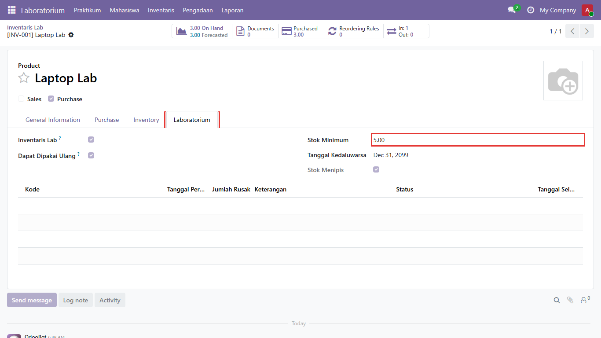

Stok awal barang baru diisi melalui **Stock Opname** (bagian 4) atau **Penerimaan Barang**
(bagian 6).

### Stok Menipis

**Inventaris > Stok Menipis** menampilkan hanya barang dengan stok di bawah atau sama dengan stok
minimum. Gunakan daftar ini sebagai dasar membuat Purchase Order.

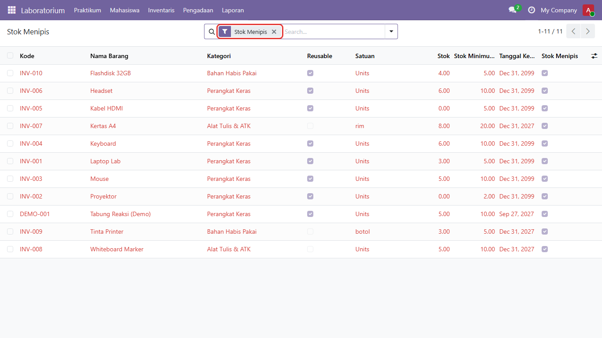

### Kategori

**Inventaris > Kategori** mengelompokkan barang, misalnya *Perangkat Keras*, *Alat Tulis & ATK*,
*Bahan Habis Pakai*. Kategori yang masih dipakai barang tidak bisa dihapus.

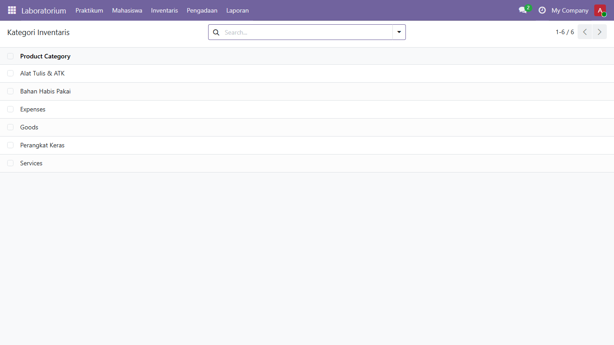

---

## 2. Perbaikan Barang

Dipakai saat ada barang rusak yang perlu diperbaiki. Selama diperbaiki, barang tidak dihitung
sebagai stok tersedia.

Buka **Inventaris > Perbaikan**. Filter **Sedang Diperbaiki** dan **Selesai** tersedia di
pencarian.

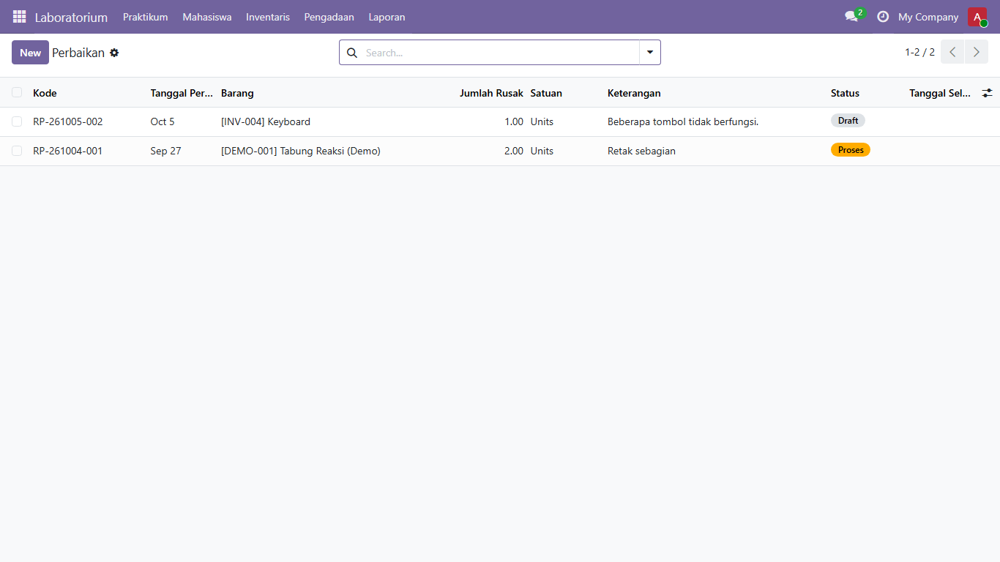

1. Klik **New**. Isi **Barang**, **Jumlah Rusak**, **Tanggal Perbaikan**, dan keterangan kerusakan.
   Simpan. Kode otomatis dibuat, misalnya `RP-261005-002`.

   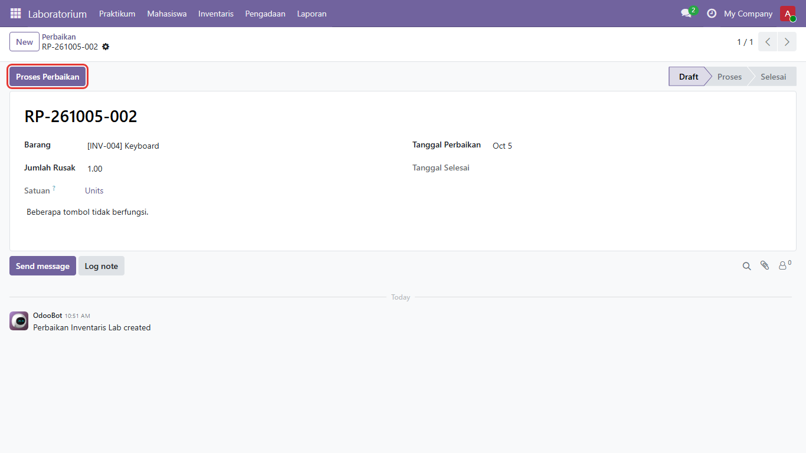

2. Klik **Proses Perbaikan**. Status menjadi **Proses** dan stok barang berkurang sejumlah barang
   rusak. Jumlah rusak tidak boleh melebihi stok yang tersedia.

   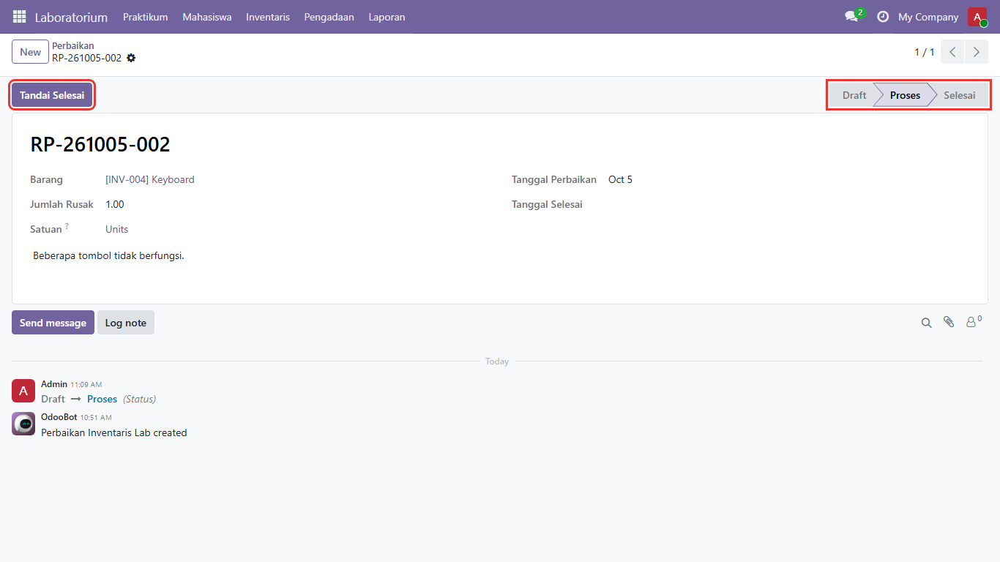

3. Setelah barang selesai diperbaiki, klik **Tandai Selesai**. Barang kembali ke stok dan
   **Tanggal Selesai** terisi.

   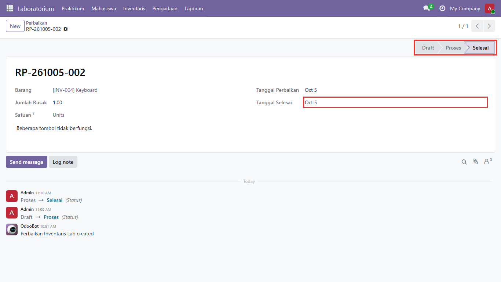

Perbaikan hanya bisa dihapus selama masih berstatus Draft.

---

## 3. Bahan/Alat Praktikum

Kebutuhan bahan/alat dicatat di tab **Bahan/Alat** pada form sesi praktikum (barang dan jumlah
**per kelompok**). Lihat [Panduan Dosen bagian 5](panduan-dosen.md#bahanalat). Total pemakaian
(jumlah per kelompok × jumlah kelompok) tampil di laporan **Penggunaan Bahan**.

---

## 4. Stock Opname

Stock opname menyamakan stok di sistem dengan hasil hitung fisik di lab.

Buka **Inventaris > Stock Opname**.

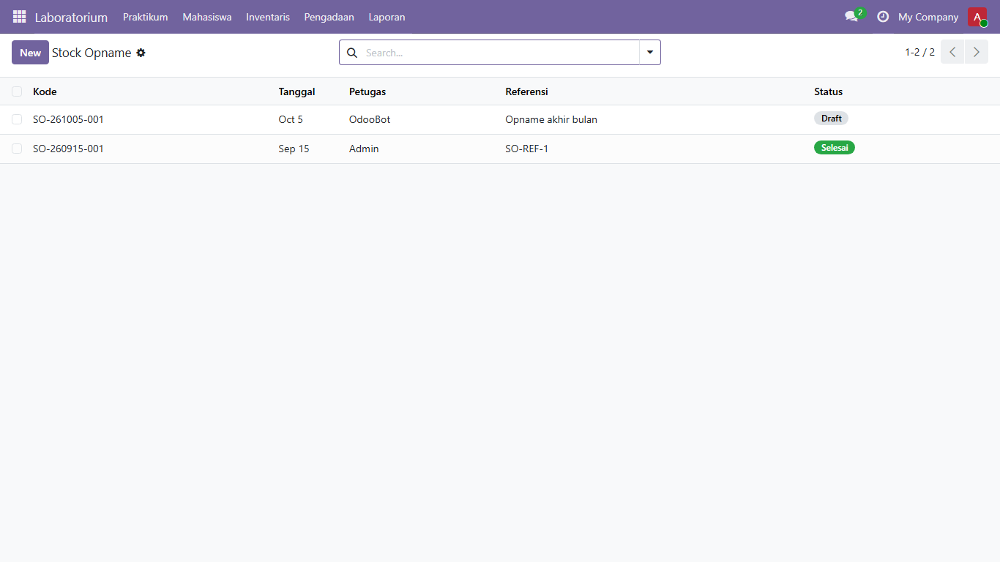

1. Klik **New**. Isi **Tanggal**, **Petugas**, dan **Referensi** (misalnya *Opname akhir bulan*).
2. Di tab **Barang**, klik **Add a line** untuk setiap barang yang dihitung:
   - **Stok Sistem** tampil otomatis.
   - Isi **Hasil Hitung** dengan jumlah fisik.
3. Simpan. Kode otomatis dibuat, misalnya `SO-261005-001`.
4. Klik **Validasi**.

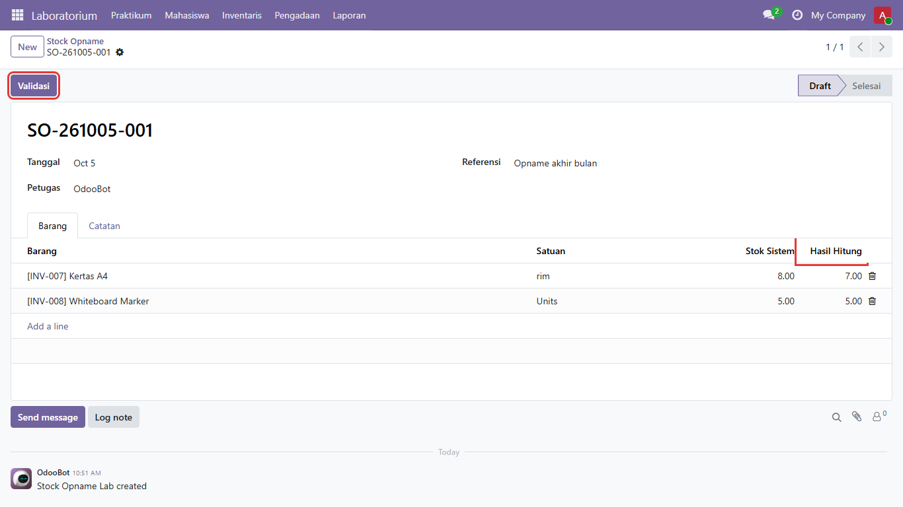

Setelah divalidasi, stok barang menjadi sama dengan **Hasil Hitung**. Form menampilkan
**Stok Sebelum**, **Hasil Hitung**, dan **Selisih** (negatif = barang kurang, positif = barang lebih).
Opname yang sudah divalidasi tidak bisa diubah atau dihapus.

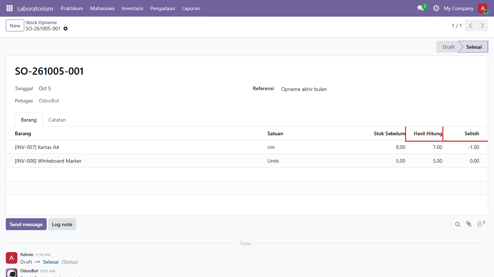

---

## 5. Supplier

**Pengadaan > Supplier** berisi daftar pemasok. Klik **New** untuk menambah supplier (nama
perusahaan, alamat, telepon, email). Kontak person (PIC) ditambahkan di tab **Contacts** pada form
supplier.

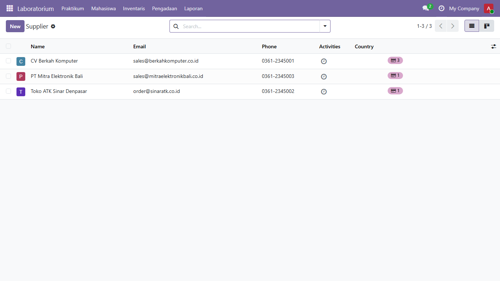

---

## 6. Purchase Order dan Penerimaan Barang

Menu Pengadaan memakai modul **Purchase** dan **Inventory** bawaan Odoo. Saat membukanya, bilah
menu atas berganti menjadi menu *Purchase*. Untuk kembali, klik ikon aplikasi di kiri atas lalu
pilih **Laboratorium**.

### Membuat Purchase Order (PO)

Buka **Pengadaan > Purchase Order**.

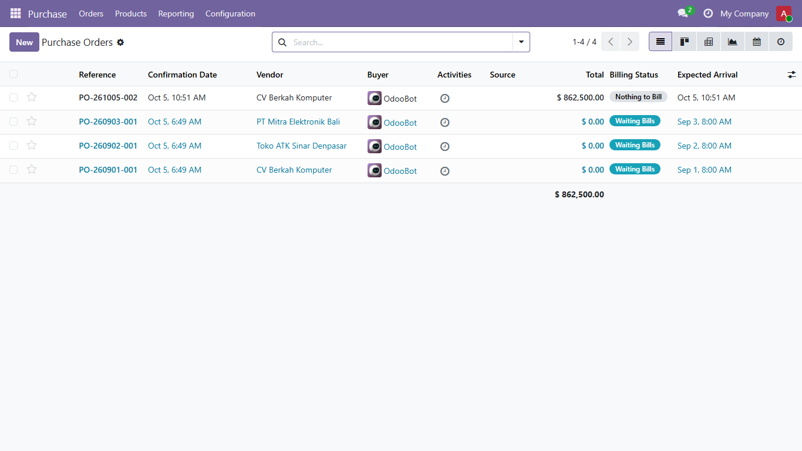

1. Klik **New**.
2. Pilih **Vendor** (supplier).
3. Di tab **Products**, klik **Add a product**, pilih barang, isi **Quantity** dan **Unit Price**.
4. Simpan. Dokumen masih berstatus **RFQ** (permintaan penawaran).

   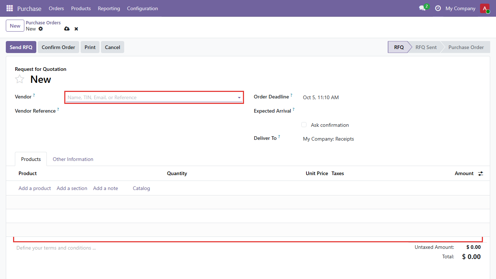

5. Setelah harga disepakati, klik **Confirm Order**. Status menjadi **Purchase Order** dan nomor PO
   berformat `PO-YYMMDD-NNN`, misalnya `PO-261005-002`.

   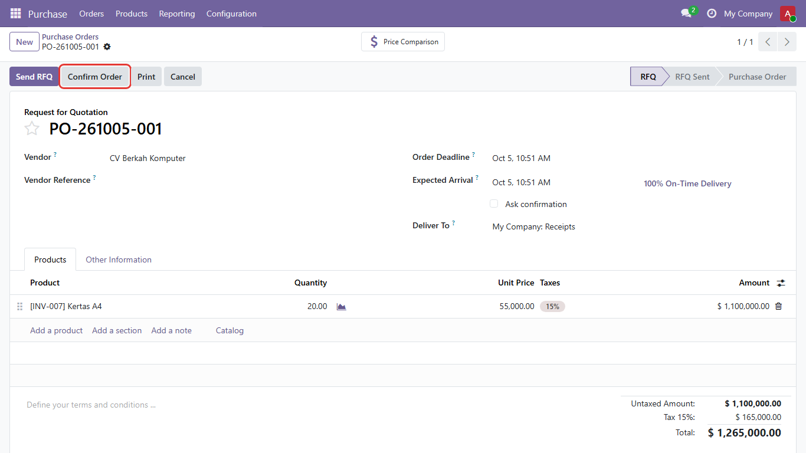

### Menerima Barang

Setelah PO dikonfirmasi, Odoo otomatis membuat dokumen penerimaan (*Receipt*).

1. Pada PO, klik tombol **Receipt** di bagian atas (atau **Receive**).

   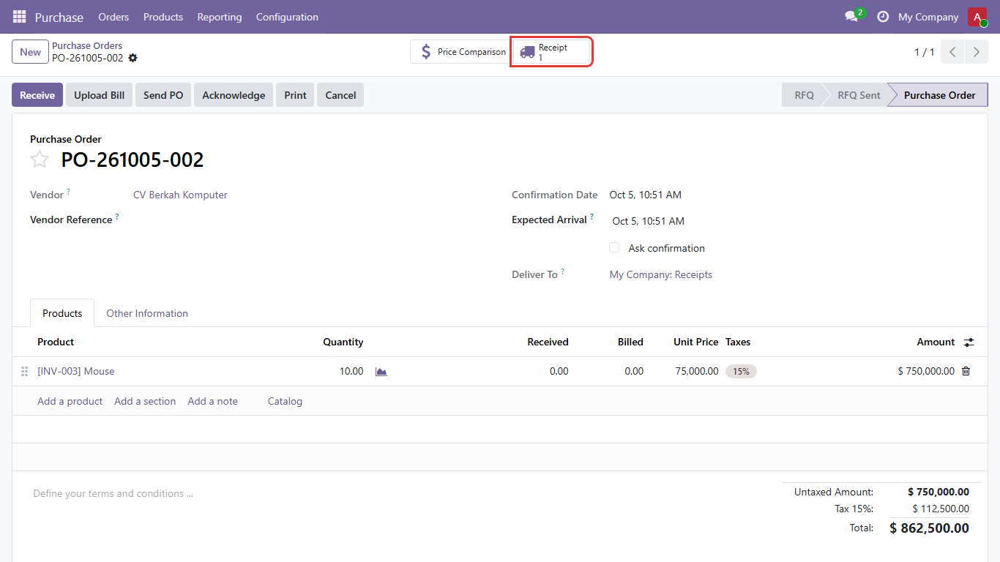

2. Periksa barang yang datang. Sesuaikan kolom **Quantity** bila jumlah yang diterima berbeda dari
   pesanan.
3. Klik **Validate**.

   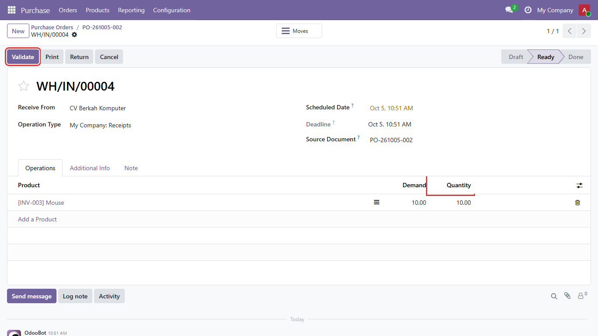

4. Status menjadi **Done** dan stok barang bertambah. Jika barang baru diterima sebagian, Odoo
   menawarkan membuat penerimaan susulan (*backorder*) untuk sisanya.

   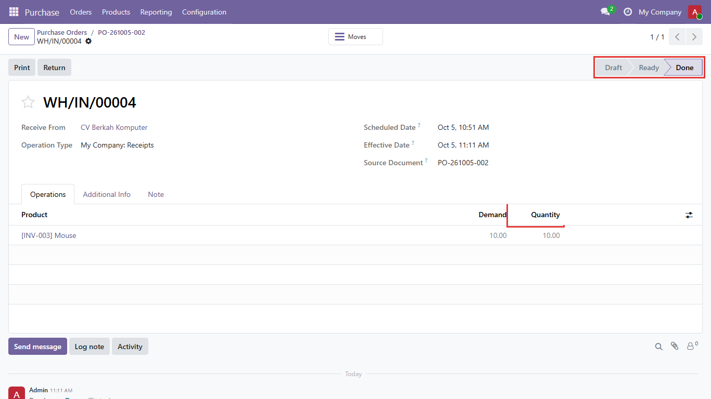

Semua penerimaan juga bisa dibuka dari **Pengadaan > Penerimaan Barang**.

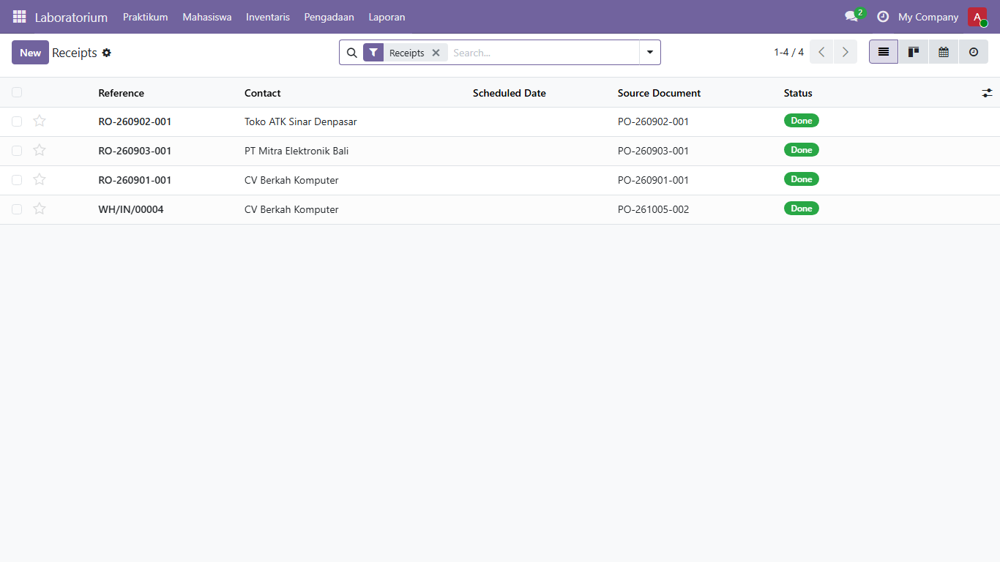

---

## 7. Laporan

Semua laporan ada di menu **Laporan** dan bisa difilter, dikelompokkan, serta diekspor ke Excel
(centang baris > **Actions > Export**).

### Penggunaan Bahan

Pemakaian barang per sesi praktikum: **Qty per Kelompok × Jumlah Kelompok = Total Pemakaian**,
beserta stok sekarang. Tampilan pivot (ikon tabel) merekap per barang dan praktikum.

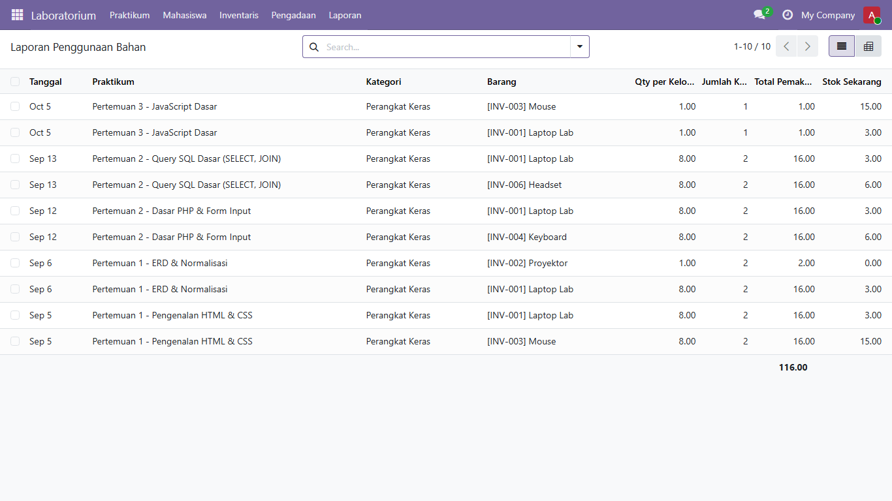

### Pembelian

Barang yang sudah diterima dari supplier: tanggal, kode penerimaan, kode PO, supplier, barang, dan
jumlah diterima. Laporan ini khusus peran Admin / Laboran.

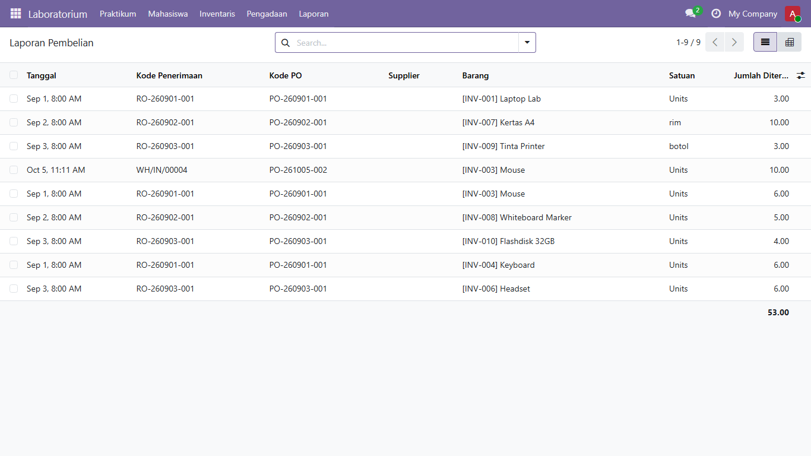

### Penyesuaian Stok

Hasil stock opname yang sudah divalidasi: stok sebelum, hasil hitung, selisih, dan stok sekarang
per barang.

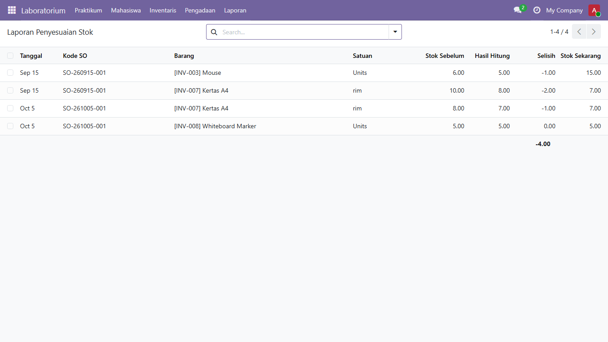
