# Panduan Mahasiswa: Presensi, Upload Berkas, Pretest/Posttest, dan Nilai Praktikum

Panduan ini untuk mahasiswa yang mengikuti praktikum laboratorium. Semua kegiatan dilakukan di
satu halaman: **Praktikum** di portal Odoo. Anda bisa membukanya dari laptop maupun HP.

Yang dibahas:

1. Login dan mengganti password
2. Membuka halaman Praktikum
3. Presensi dengan token
4. Upload berkas laporan
5. Mengerjakan pretest dan posttest
6. Melihat nilai
7. Pesan yang mungkin muncul dan solusinya

---

## 1. Login

Akun Anda dibuat oleh laboran. **Login = email Anda yang terdaftar di data mahasiswa**, password
diberikan oleh laboran/admin.

1. Buka alamat Odoo kampus yang diberikan laboran.
2. Isi **Email** dan **Password**.
3. Klik **Log in**.

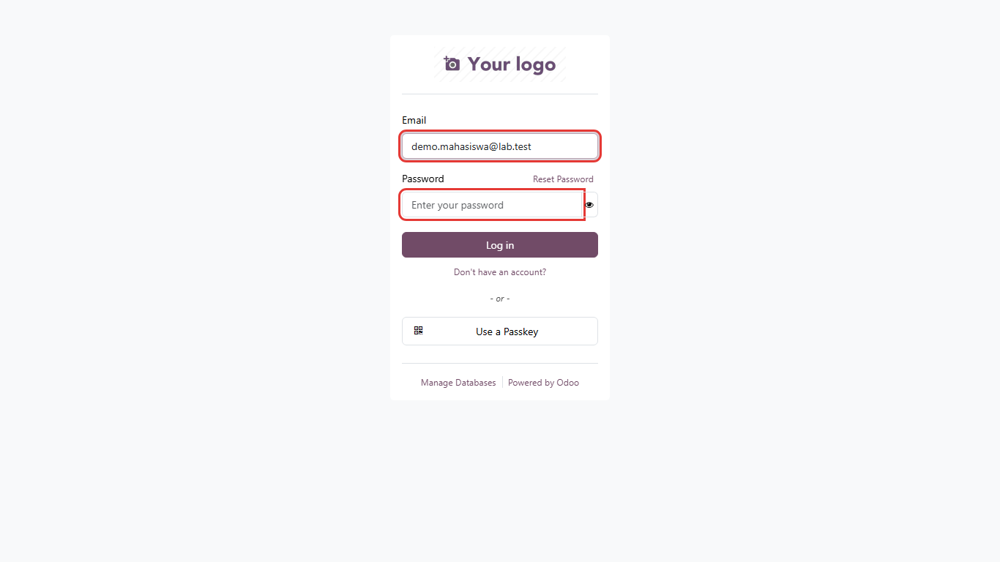

### Mengganti Password

Setelah login pertama kali, sebaiknya ganti password:

1. Klik nama Anda di pojok kanan atas, lalu pilih **My Account**.
2. Klik kartu **Connection & Security**.
3. Isi **Password** (password lama), **New Password**, dan **Verify New Password**.
4. Klik **Change Password**.

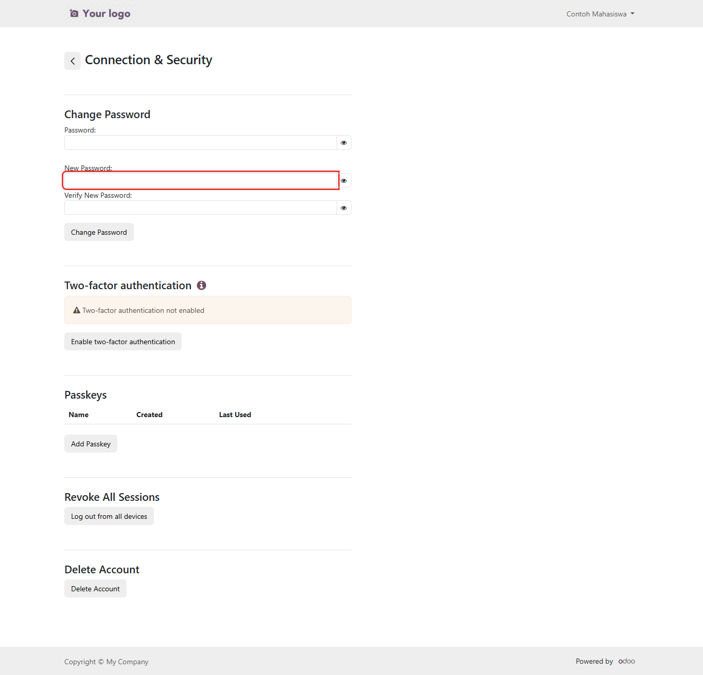

Lupa password? Hubungi laboran/admin lab untuk dibuatkan password baru.

---

## 2. Membuka Halaman Praktikum

Setelah login, Anda masuk ke halaman **My account**. Klik kartu **Praktikum**.

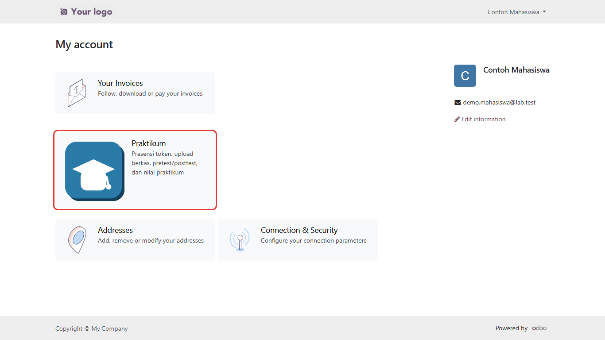

Halaman Praktikum menampilkan nama dan NIM Anda, lalu tabel semua sesi praktikum yang Anda ikuti
(sesi terbaru di atas).

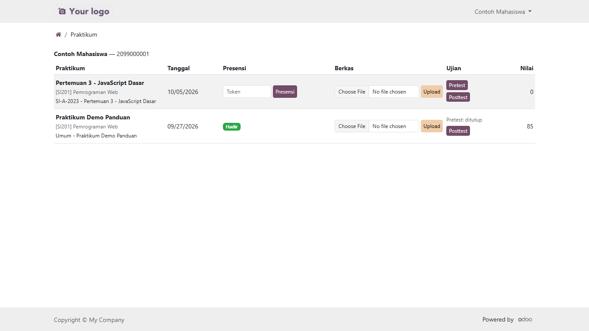

| Kolom | Isi |
|---|---|
| Praktikum | Nama sesi, mata kuliah, dan kelompok Anda |
| Tanggal | Tanggal praktikum |
| Presensi | Kotak isian token, atau badge hijau **Hadir** bila sudah presensi |
| Berkas | Nama berkas yang sudah diupload, dan tombol untuk upload |
| Ujian | Tombol **Pretest** dan **Posttest**, atau keterangan "ditutup" / "belum ada soal" |
| Nilai | Nilai praktikum dari dosen/laboran (0 = belum dinilai) |

Sesi praktikum hanya muncul bila Anda sudah dimasukkan ke salah satu **kelompok** oleh laboran.
Jika halaman bertuliskan *"Anda belum terdaftar di kelompok praktikum mana pun"*, hubungi laboran.

---

## 3. Presensi dengan Token

Saat praktikum berlangsung, dosen/laboran menampilkan **token** 6 karakter (huruf dan angka),
misalnya `J3N4NW`. Token berlaku **4 jam** sejak dibuat.

1. Pada baris praktikum hari ini, ketik token di kotak **Token**. Huruf besar/kecil tidak berpengaruh.
2. Klik **Presensi**.

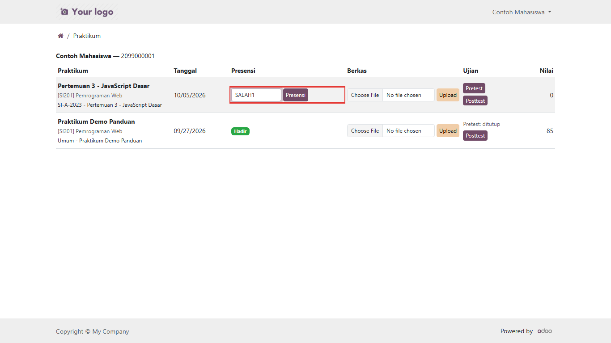

Bila token benar, muncul pesan hijau **Berhasil Presensi** dan kolom Presensi berubah menjadi
**Hadir**.

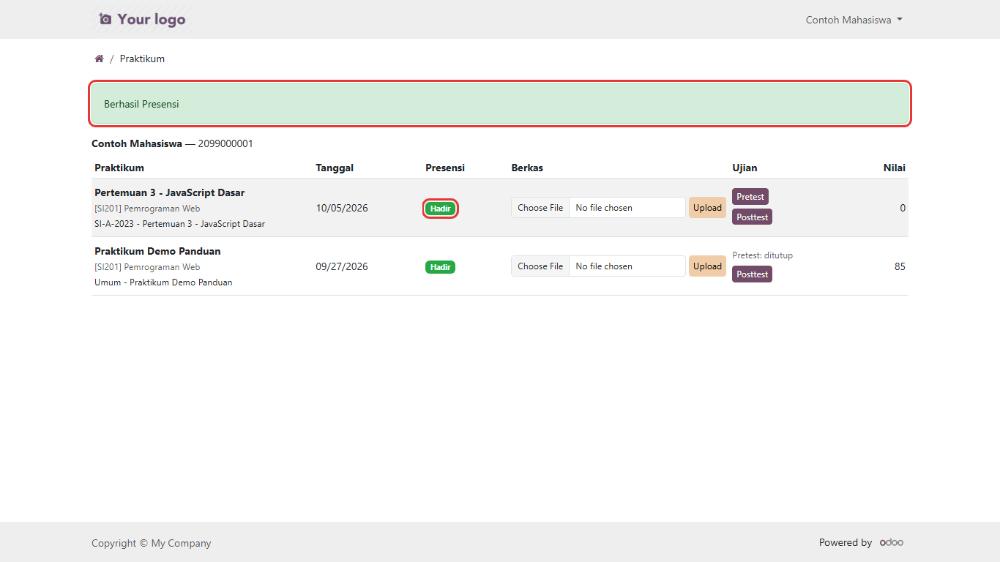

Bila token salah, muncul pesan merah. Periksa kembali token lalu ulangi.

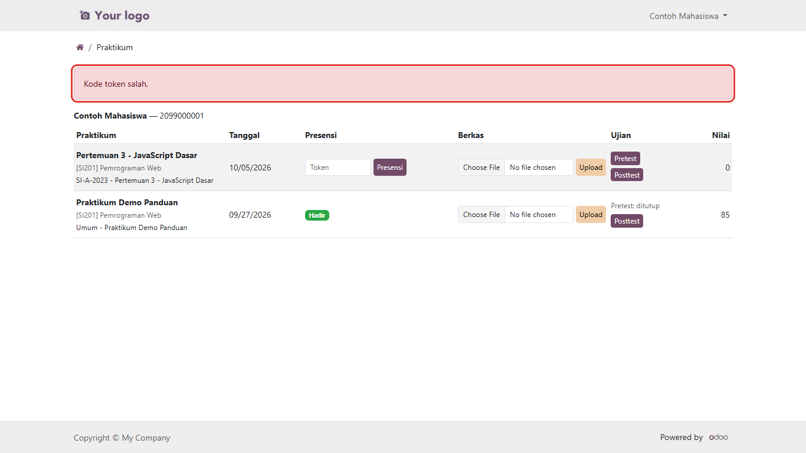

---

## 4. Upload Berkas Laporan

1. Pada baris praktikum yang sesuai, klik **Choose File** di kolom **Berkas** dan pilih file
   laporan Anda (PDF, Word, ZIP, gambar, dan sebagainya).
2. Klik **Upload**.

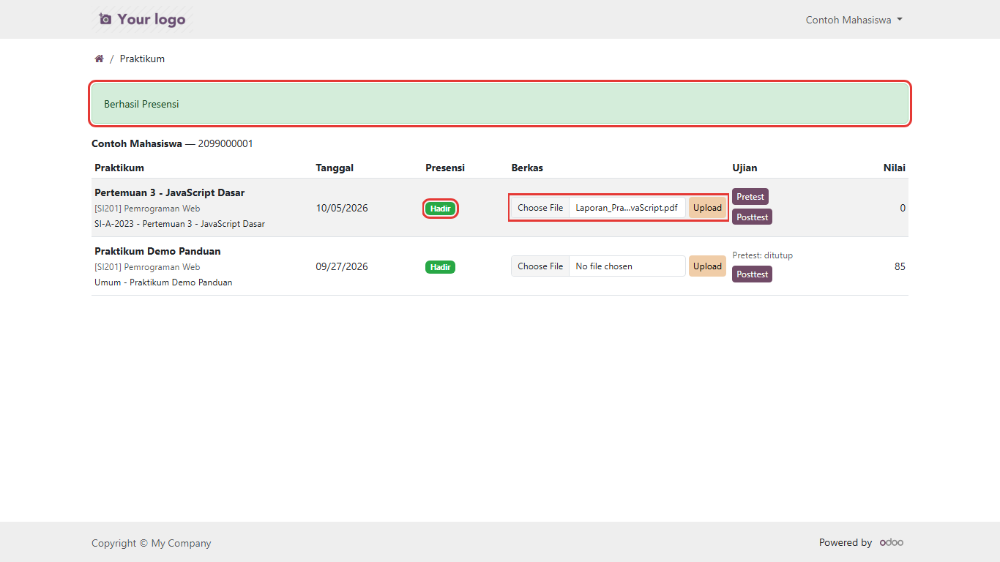

Muncul pesan **Berkas Berhasil Diupload**, dan nama file tampil di atas tombol upload.

Catatan:

- Ukuran berkas maksimal **10 MB**.
- Setiap praktikum menyimpan **satu berkas**. Upload ulang akan **mengganti** berkas sebelumnya.

---

## 5. Mengerjakan Pretest dan Posttest

### Kapan Ujian Bisa Dikerjakan

| Ujian | Bisa dikerjakan |
|---|---|
| **Pretest** | Kapan saja **sampai akhir tanggal praktikum** (pukul 23:59 WITA) |
| **Posttest** | **Mulai tanggal praktikum** sampai **batas posttest** yang ditentukan dosen (pukul 23:59 WITA) |

Di luar waktu tersebut, kolom Ujian menampilkan teks *"Pretest: ditutup"* atau
*"Posttest: ditutup"*. Jika dosen belum membuat soal, tertulis *"belum ada soal"*.

### Langkah Mengerjakan

1. Klik tombol **Pretest** (atau **Posttest**) pada baris praktikum.

   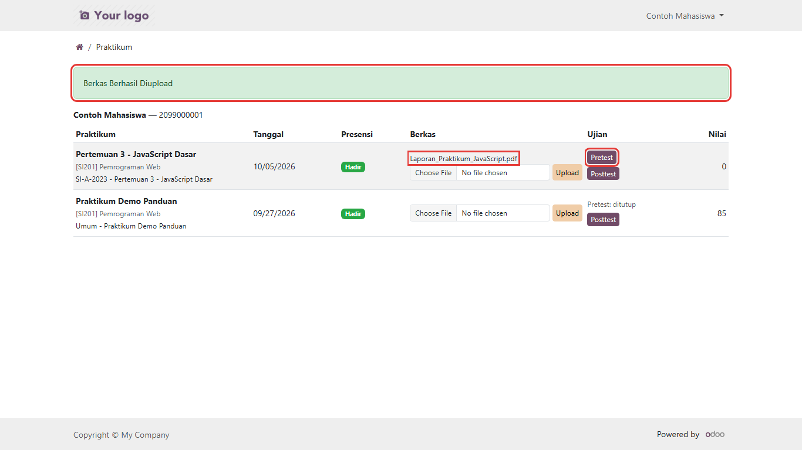

2. Halaman ujian terbuka. Klik **Start Survey**.

   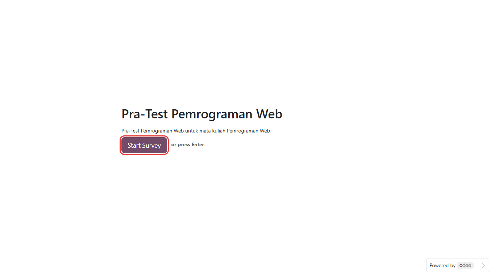

3. Jawab semua soal pada kotak jawaban.

   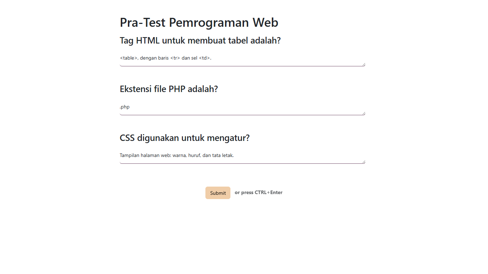

4. Klik **Submit**, lalu klik **Submit** sekali lagi di jendela konfirmasi.

   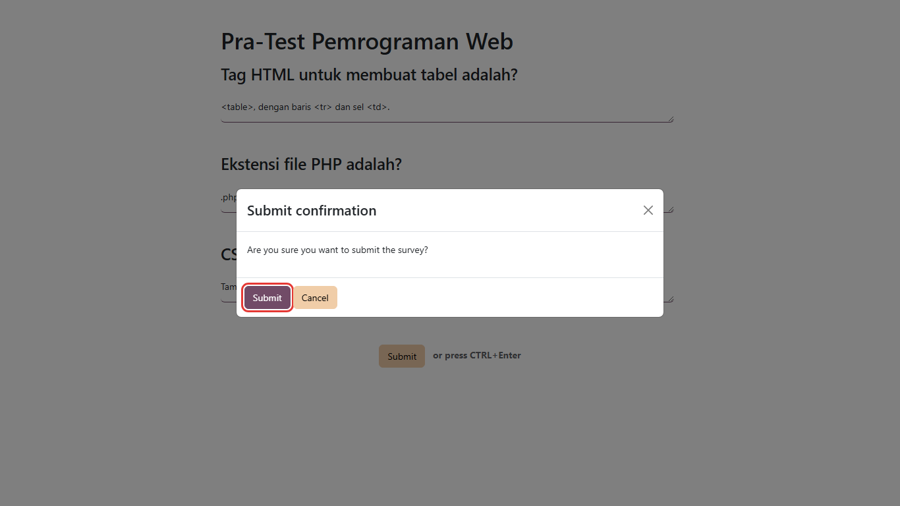

5. Muncul halaman **Thank you!**. Klik **Kembali ke Praktikum** untuk kembali ke daftar praktikum.

   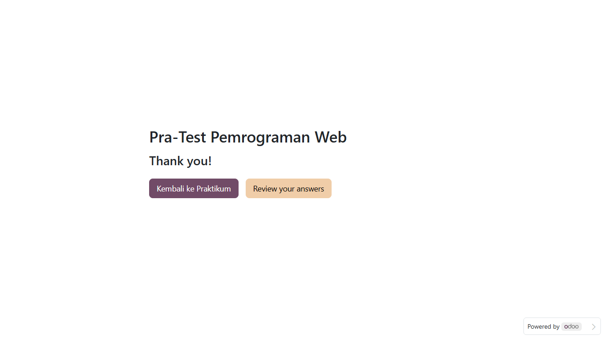

### Mengubah Jawaban

Selama waktu ujian masih terbuka, tombol berubah menjadi **Pretest (ubah jawaban)**. Klik tombol
itu untuk memperbaiki jawaban, lalu Submit lagi. Jawaban yang tersimpan adalah kiriman terakhir.
Setelah waktu ujian lewat, jawaban tidak bisa diubah lagi.

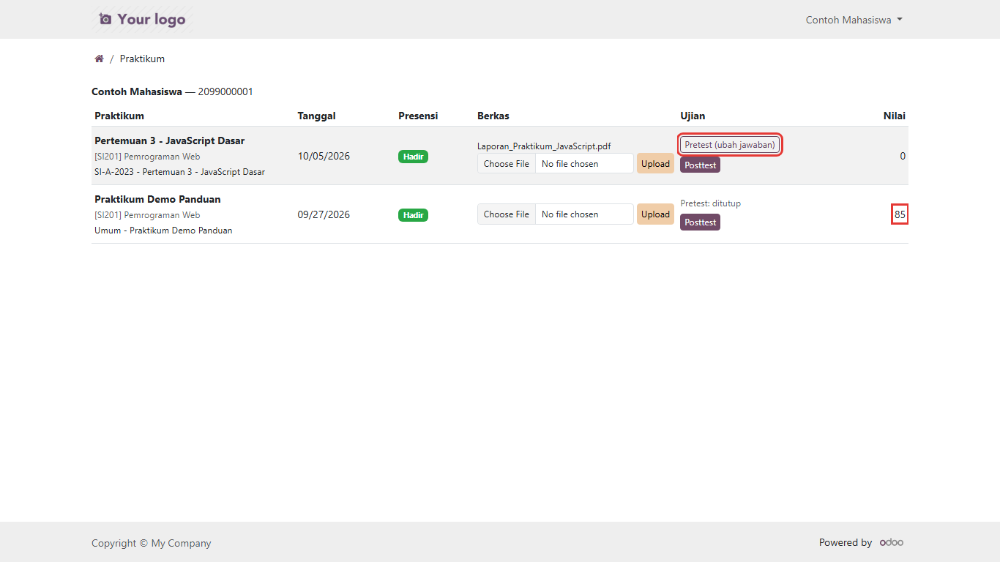

Jawaban pretest/posttest dinilai **manual** oleh dosen. Halaman ujian tidak menampilkan skor.

---

## 6. Melihat Nilai

Nilai tampil di kolom **Nilai** paling kanan pada halaman Praktikum (lihat gambar di atas, contoh
nilai **85**). Nilai **0** berarti dosen/laboran belum mengisi nilai untuk sesi tersebut.

---

## 7. Pesan yang Mungkin Muncul

| Pesan | Arti / yang harus dilakukan |
|---|---|
| Kode token salah. | Token tidak sama dengan token yang aktif. Periksa kembali, atau minta dosen menampilkan token terbaru |
| Kode token sudah kadaluwarsa, minta kode baru ke dosen/laboran. | Token sudah lewat 4 jam. Minta dosen membuat token baru |
| Anda belum terdaftar di kelompok untuk praktikum ini, hubungi admin. | Anda belum dimasukkan ke kelompok praktikum tersebut |
| Akun Anda belum terhubung ke data mahasiswa, hubungi admin. | Email akun berbeda dengan email di data mahasiswa. Minta laboran memperbaiki email Anda |
| Pretest hanya bisa dikerjakan sebelum/pada tanggal praktikum. | Waktu pretest sudah lewat |
| Posttest baru bisa dikerjakan mulai tanggal praktikum berlangsung. | Tunggu sampai tanggal praktikum |
| Posttest sudah melewati batas waktu (due date). | Waktu posttest sudah lewat |
| Tidak ada soal untuk jenis ujian ini. | Dosen belum mengisi soal |
| Ukuran berkas maksimal 10 MB. | Perkecil file (kompres PDF/gambar atau jadikan ZIP) |
| Pilih berkas terlebih dahulu. | Klik **Choose File** dan pilih file sebelum menekan Upload |
