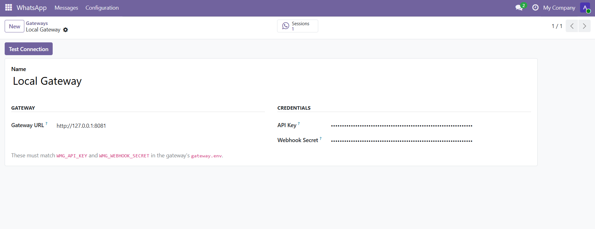
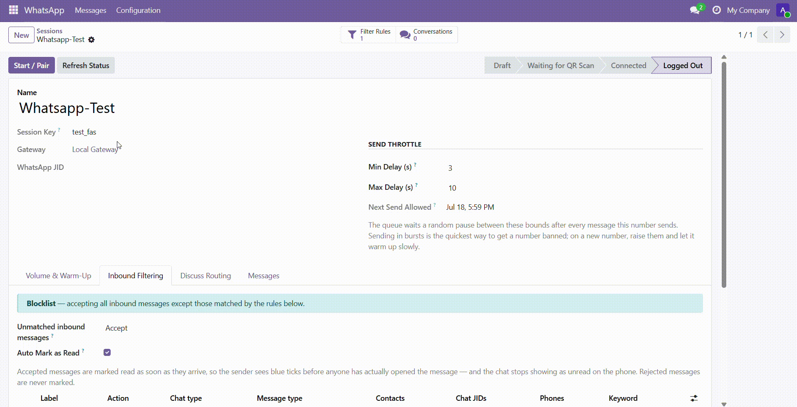
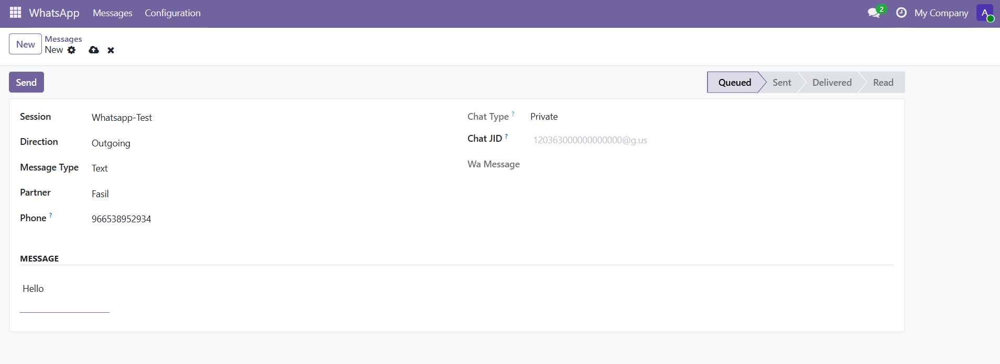
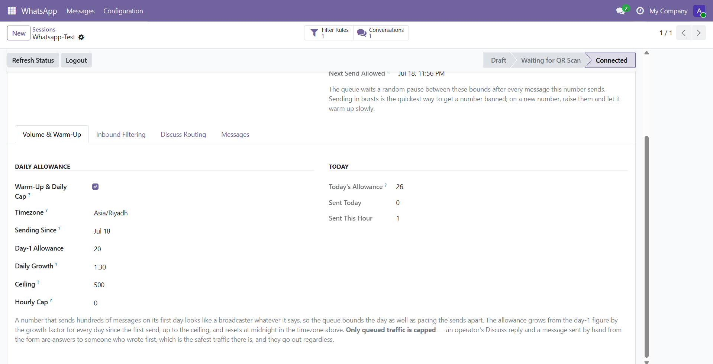
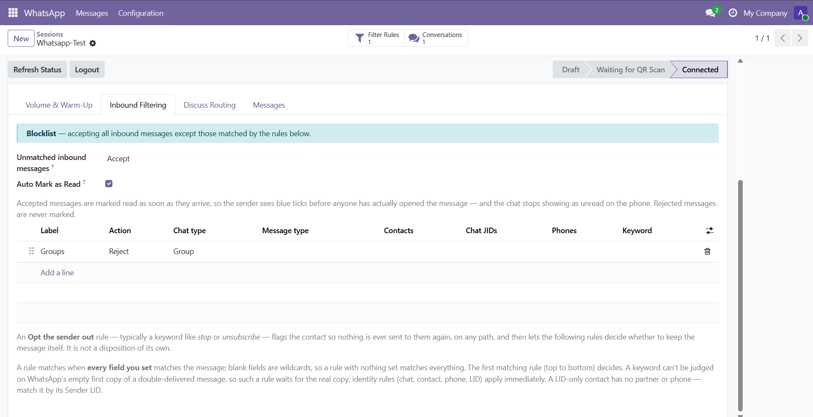

## Overview

**Whatsmeow WhatsApp Connector** (`whatsmeow`) drives one or more self-hosted whatsmeow gateways straight from Odoo — send and receive WhatsApp messages without Meta's Cloud API, without template pre-approval, and without a 24-hour session window. Each gateway connection is one endpoint, each session is one WhatsApp number paired by QR, and every inbound message is logged, matched to a contact, and posted where you can act on it.

It is built for teams who want to own their WhatsApp channel: a support desk running a shared number, a sales team messaging leads, or any business that needs WhatsApp inside Odoo but does not want to route customer conversations through a third-party SaaS. Deliverability safeguards — pacing, warm-up ramps, daily caps, opt-out handling, and number validation — are part of the core, because staying unbanned on the unofficial protocol is the whole game.

### 📡 Self-Hosted, No Cloud Middleman
Connect Odoo to your own whatsmeow gateway instead of a paid WhatsApp Business API. There is no per-message fee, no template approval queue, and no session window — a message is just a message, sent from a number you control.

### 🛡️ Deliverability Built In
Bursting is what gets a number banned, so the outgoing queue paces every send, ramps a new number's daily allowance up over its first weeks, and honours per-contact opt-outs and "not on WhatsApp" answers — all before a single message leaves the door.

### 📥 Inbound That Lands Where You Work
Incoming messages are matched to the right contact by phone number, downloaded with their media, and posted to that contact's chatter. Per-session filter rules decide what to accept, and read receipts can be sent automatically the moment a message is kept.

## Features

### 🔌 Multi-Gateway & Multi-Number Management
Register any number of gateway endpoints as connections, each with its own URL, API key, and webhook secret, and pair any number of WhatsApp numbers as sessions beneath them. A one-click **Test** button validates that a gateway is reachable and its key is valid.

### 📷 QR Pairing & Live Status
Start a session and Odoo renders the WhatsApp pairing QR right on the form. A scheduled action keeps each session's status current — Starting, Waiting for QR Scan, Connected, Disconnected, or Logged Out — so you always know which numbers are live.

### 💬 Send Text & Media, With Replies
Compose text, images, video, audio, documents, or stickers from a message form. Reply to an inbound message to quote it in WhatsApp, and send voice notes that play inline. Sends can target a private chat or a group.

### 🚦 Paced Outgoing Queue
Outgoing messages go onto a throttled queue that spaces each number's sends apart by a random delay, takes turns between numbers so one busy session never stalls another, and carries an idempotency key so a mid-transaction crash can never send the same message twice. Failed sends are marked and can be retried.

### 📈 Warm-Up Ramp & Volume Caps
Each session can cap how many queued messages it sends per day, starting low for a brand-new number and growing automatically as the number ages toward a ceiling you set. An hourly cap stops a day's allowance leaving in one burst, and the daily window rolls over at the number's own local midnight.

### 🚫 Opt-Out & Number Validation
A contact who asks to stop — by hand or by writing an opt-out keyword — is flagged, and no path can ever message them again: not the queue, the composer, a server action, or a Discuss reply. Separately, the gateway is asked which queued numbers are actually on WhatsApp, so dead numbers are skipped rather than burned.

### 🕗 Sending Hours & Human Pacing
Queued messages can be held to the hours a person would plausibly be working, in the number's own timezone — messaging people at 3 a.m. is a direct route to being reported. Before each message the recipient's phone shows *typing…* (or *recording audio* before a voice note) for a moment, the way a real client does, with the pause scaled to the message length. Operator replies ignore the window: people do sometimes work late.

### 🛑 Automatic Queue Pause
A run of failed sends is what a rate limit or a fresh block looks like from Odoo's side, and retrying into one is how a warning becomes a ban. After a configurable number of consecutive gateway failures the queue stops using that number and says why, and a session that is logged out or in error is skipped outright instead of producing one failure per queued message. A manager presses **Resume Queue** after looking; hand-sent messages and operator replies are never blocked.

### 🔎 Inbound Filter Rules
Every session carries an ordered list of accept/reject rules matched on chat type, message kind, sender, phone, chat JID, LID, or a body keyword. Combine a default of Accept with reject rules for a blocklist, or a default of Reject with accept rules for an allowlist. A dedicated opt-out action flags the sender while still keeping the message on file.

### 🧾 Inbound Delivery to the Chatter
An accepted message is matched to a contact on the last ten digits of their number and posted to their chatter with any media attached and voice notes flagged to play inline. Group messages are labelled with the group name so they never read as a private message. Optionally, a read receipt is sent the moment the message is accepted.

## Installation

Installing the add-on from the Apps list is the standard Odoo step. What is specific to this module is deploying the **whatsmeow gateway** first — the self-hosted service the connector talks to.

### 🚀 Deploy the whatsmeow Gateway
The gateway is a single Go binary that speaks the WhatsApp Web protocol on one side and HTTP+JSON to Odoo on the other. An installer sets it up as a systemd service on Debian 12/13 or Ubuntu 22.04/24.04:

- Clone the repository onto the gateway host — running it on the same machine as Odoo is the simple case.
- From the repository root, run `sudo ./install.sh`.
- When it finishes it prints a **Gateway URL**, **API Key**, and **Webhook Secret** — keep these for the connection record.

```bash
git clone https://github.com/fasilwdr/whatsmeow-odoo.git
cd whatsmeow-odoo
sudo ./install.sh
```

One gateway can host several WhatsApp numbers, and one Odoo can drive several gateways. Re-running the installer safely rebuilds and restarts the service, keeping your credentials and paired sessions. See `DEPLOY.md` for options such as a custom port, a cross-host webhook URL, TLS, and backups. With the gateway running, register it under **WhatsApp → Configuration → Gateways** using the printed credentials (see Configuration below).

## Configuration

All setup lives under the **WhatsApp → Configuration** menu (visible to WhatsApp Administrators).

- **Register a gateway**: Go to **WhatsApp → Configuration → Gateways**, click **New**, and enter the **Gateway URL**, the **API Key** (must match `WMG_API_KEY` on the gateway), and the **Webhook Secret** (must match `WMG_WEBHOOK_SECRET`). Click **Test** to confirm Odoo can reach it and the key is valid.
- **Point the gateway's webhook at Odoo**: Configure the gateway to POST events to `/whatsmeow/webhook` on your Odoo, using the same webhook secret — that secret is how inbound events are routed back to the right connection.
- **Pair a WhatsApp number**: Go to **WhatsApp → Configuration → Sessions**, click **New**, give it a **Session Key** (lowercase letters, digits, `-` and `_`), choose the gateway, then **Start** and scan the QR with WhatsApp on the phone.
- **Tune send pacing**: On the session, set the **Min/Max Delay** between sends and, under **Warm-Up & Daily Cap**, the Day-1 Allowance, Daily Growth, Ceiling, Hourly Cap, and Timezone.
- **Set sending hours**: On the same tab, turn on **Restrict Sending Hours** and set **Send From** / **Send Until** in the session's timezone. Set an end earlier than the start for a window that runs past midnight.
- **Tune how human it looks**: Leave **Show Typing** on and set the **Typing Cap**, and set **Pause After Failures** — the number of consecutive gateway failures that pauses this number's queue (0 never pauses).
- **Set inbound behaviour**: On the session, choose what to do with unmatched inbound messages, add **Inbound Filter Rules**, and optionally enable **Auto Mark as Read**.

## Screenshots

The screenshots below walk through connecting a gateway, pairing a number, sending a message, and keeping a number healthy.

> Registering a gateway connection


> Pairing a WhatsApp number by scanning its QR


> Composing and sending a WhatsApp message


> Warm-up ramp and daily/hourly volume caps on a session


> Per-session inbound filter rules


## Usage

### 🔗 Connect a Gateway
**WORKFLOW · 01**
Register your self-hosted gateway so Odoo can talk to WhatsApp through it.

- Go to **WhatsApp → Configuration → Gateways** and click **New**.
- Enter the **Gateway URL**, **API Key**, and **Webhook Secret** exactly as configured on the gateway.
- Click **Save**, then **Test** — a green notification confirms the gateway is reachable and the key is valid.
- Configure the gateway to send its webhooks to `/whatsmeow/webhook` with the same secret.

### 📱 Pair a WhatsApp Number
**WORKFLOW · 02**
Bring a WhatsApp number online as a session you can send and receive from.

- Go to **WhatsApp → Configuration → Sessions** and click **New**.
- Enter a **Session Key**, choose the **Gateway**, and click **Save**.
- Click **Start**, then scan the pairing QR that appears with WhatsApp on the phone.
- Watch the status turn to **Connected**; the number is now live.

### 📨 Send a Message
**WORKFLOW · 03**
Send a text or a file to a WhatsApp contact.

- Go to **WhatsApp → Messages** and click **New**.
- Pick the **Session** to send from, enter the **Recipient** number, and type your message — or attach a file to send media.
- Click **Send**; the message joins the paced outgoing queue and its state updates as WhatsApp confirms delivery and read.
- To answer an incoming message, open it and click **Reply** — the response is addressed back to the same chat and quotes the original.

### 🩺 Keep a Number Healthy
**WORKFLOW · 04**
Protect a number's reputation so it keeps sending.

- On the session, enable **Warm-Up & Daily Cap** and set the Day-1 Allowance, Growth, and Ceiling to ramp volume gradually.
- Add **Inbound Filter Rules** to decide what the number accepts, and add an **Opt the sender out** rule keyed on your stop-word so requests to stop are honoured automatically.
- Leave number validation to run in the background — queued messages to numbers that turn out not to be on WhatsApp are skipped instead of sent.

## Known Issues

This module talks to an unofficial WhatsApp protocol through a self-hosted gateway, so a few things are outside Odoo's control by design.

> WhatsApp can rate-limit or ban a number that behaves like a bulk sender. The pacing, warm-up, opt-out, and number-validation features exist to reduce that risk, but no safeguard can guarantee a number is never restricted — warm up new numbers slowly and keep your lists clean.

> Number-registration and validation lookups are rationed by the gateway on purpose. A number Odoo has not yet been able to check is treated as sendable, not as invalid, so a fresh contact is never permanently blocked by a missing answer.

## FAQ

**Do I need a WhatsApp Business API account or Meta approval?**
No. This module connects to your own self-hosted whatsmeow gateway over the unofficial Web protocol. There is no template approval, no per-message fee, and no 24-hour session window.

**Can I run more than one WhatsApp number?**
Yes. Register as many gateway connections as you like and pair as many sessions (numbers) beneath them as you need. Each session has its own pacing, warm-up, and inbound rules — one number's reputation never affects another's.

**How are incoming messages matched to my contacts?**
By the last ten digits of the sender's phone number, compared against your contacts' phone fields regardless of how they are formatted. A message from an unknown number is still stored; it simply has no contact attached.

**Who can configure gateways and see the API keys?**
Only members of the **WhatsApp / Administrator** group. The API key and webhook secret are restricted fields — a regular WhatsApp user can send and receive messages without ever being able to read a gateway's credentials.

**What happens if a send fails or the gateway is down?**
The message is marked in error with the reason, and the rest of the queue keeps moving — one bad send never stalls the others. You can retry it once the gateway is healthy again; the idempotency key ensures a message that already reached WhatsApp is never sent twice.

## Changelog

### v19.0.1.6.0 — 2026-09-02
- Per-session sending hours, in the number's own timezone, honoured by the queue only
- A typing (or *recording audio*) indicator before each message, scaled to its length
- The queue pauses a number after consecutive gateway failures, with a manual **Resume Queue**
- A logged-out or errored session is skipped by the queue instead of failing every message

### v19.0.1.5.0 — 2026-07-19
- Warm-up ramp with per-session daily and hourly volume caps, rolling over at the number's own local midnight
- Per-contact opt-out honoured across every send path, with opt-out keyword rules on inbound
- Background number validation that skips queued sends to numbers not on WhatsApp
- Per-session inbound filter rules (allowlist/blocklist) and optional automatic read receipts
- Reply-with-quote, group messaging, and inline voice notes
