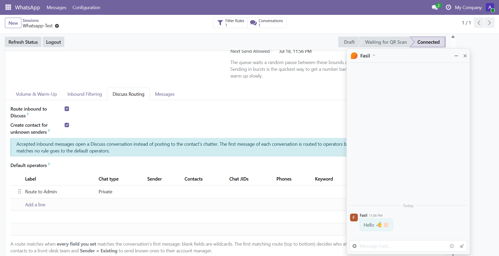

## Overview

**Whatsmeow Discuss Routing** (`whatsmeow_discuss`) turns accepted inbound WhatsApp messages into live Discuss conversations. Instead of an incoming message quietly landing on a contact's chatter, it opens a real thread in Odoo Discuss that your team attends and replies to — an operator simply types in the conversation, and the reply goes back out over WhatsApp.

Each WhatsApp conversation maps to exactly one Discuss channel, so a customer's messages stay in one place and the whole team can see the history. Per-session routing rules decide who attends a new conversation — send first-time contacts to a front desk, known customers to their account manager — and the whole thing is opt-in per session, so any number you do not route keeps posting to the chatter exactly as before.

### 💬 WhatsApp Inside Discuss
Every WhatsApp conversation becomes a native Discuss channel. Operators read and reply in the thread they already use for internal chat, and their replies are relayed straight back to WhatsApp — no separate inbox, no context switch.

### 🧭 Rule-Based Routing
When a new conversation's first message arrives, ordered routing rules pick which operators attend it, matched on the same dimensions as the core inbound filter — sender, chat type, keyword, and more. First match wins; anything unmatched goes to the session's default operators.

### 🎚️ Opt-In Per Session
Routing is off by default and enabled one session at a time. A session with routing on opens Discuss conversations; a session with it off behaves exactly as it did before this module was installed, still posting to the contact's chatter.

## Features

### 🔀 Conversation-to-Channel Mapping
Each WhatsApp conversation — one WhatsApp number talking to one chat — becomes a single Discuss channel of type **WhatsApp**. Inbound messages post into it as the correspondent, and the mapping is race-safe, so two messages arriving at once still yield exactly one conversation.

### ✍️ Reply From the Thread
An operator's reply, typed in the Discuss conversation, is relayed out over WhatsApp immediately — a live reply happens at human speed and does not wait on the paced queue. Replying to a specific bubble quotes that message on WhatsApp, and attachments are sent as media.

### 👥 Routing Rules & Default Operators
Add ordered routing rules per session to decide who attends a new conversation, using criteria like **Sender = New** (first-time contact) or **Sender = Existing** (known contact), chat type, phone, chat JID, or a keyword. A conversation matching no rule goes to the session's **Default operators**.

### 🆕 Automatic Contact Creation
A Discuss conversation needs a correspondent, so an inbound message from an unknown number can create a contact from the sender's WhatsApp name and number. A sender WhatsApp only identifies by LID (with no phone) falls back to a generic correspondent instead.

### 🙂 Inbound Reactions & Read Markers
A WhatsApp reaction to a message is surfaced on its Discuss bubble, and conversations behave like a private thread — members see read markers — so the team can tell what has been handled.

### 🏷️ Named by Contact *and* Number
A conversation is titled **Name (+number)**, not one or the other — enough to tell three
customers with the same first name apart and to check the number against the contact record
without leaving Discuss. A conversation that opened before WhatsApp told us a name picks the
name up on a later message, while a channel you have renamed by hand is left alone. Bubbles
from a sender Odoo has no contact for are labelled with their WhatsApp name instead of
reading *Unnamed*.

### 🟢 Its Own Place in Discuss
WhatsApp conversations sit in their own **WhatsApp** section of the Discuss sidebar, carry a
WhatsApp avatar wherever Odoo draws a thread, and get a **WhatsApp** tab in the messaging
menu — so a customer on someone else's phone is never mistaken for a colleague, and the
whole day's WhatsApp traffic is one click away. The tab appears only once there is a
WhatsApp conversation to show.

### 📊 Conversations Smart Button
A routed session shows a **Conversations** button that opens every Discuss channel it has spawned, so a manager can review or jump into any WhatsApp thread for that number.

## Installation

This module extends the core connector, so **Whatsmeow WhatsApp Connector** (`whatsmeow`) must be installed first — with its gateway deployed and at least one session paired. Once the core module is in place, install this one from the Apps list like any other add-on.

## Configuration

Routing is configured per session, under **WhatsApp → Configuration → Sessions**.

- **Open a session**: Go to **WhatsApp → Configuration → Sessions** and open the number you want to attend in Discuss.
- **Enable routing**: On the **Discuss Routing** tab, turn on **Route inbound to Discuss**. From now on, accepted inbound messages on this session open a Discuss conversation instead of posting to the chatter.
- **Choose contact creation**: Leave **Create contact for unknown senders** on to auto-create a contact for a new number, or off to route unknown senders to a generic correspondent.
- **Set default operators**: Fill in **Default operators** — who attends a conversation that no rule matches.
- **Add routing rules**: In the **Routing Rules** list, add ordered rules; each rule's set fields must all match the conversation's first message, and its **Attend by** operators are added to the channel. First matching rule (top to bottom) wins.

## Screenshots

The screenshot below shows the Discuss Routing tab on a session, where routing is switched on and rules decide who attends each new conversation.

> Per-session Discuss routing: enable routing, set default operators, and order the rules

## Usage

### 🚀 Route a Number into Discuss
**WORKFLOW · 01**
Turn a WhatsApp number into a team inbox inside Discuss.

- Open the session under **WhatsApp → Configuration → Sessions** and go to the **Discuss Routing** tab.
- Turn on **Route inbound to Discuss** and set your **Default operators**.
- Add **Routing Rules** for the cases you want to split out — for example a rule with **Sender = New** attended by your front-desk team.
- Save. The next accepted inbound message opens a Discuss conversation and adds the matched operators.

### 💬 Attend a Conversation
**WORKFLOW · 02**
Handle a customer's WhatsApp messages from Discuss.

- Open **Discuss**; routed conversations appear as WhatsApp channels you have been added to.
- Read the incoming messages and type your reply in the thread — it is sent back over WhatsApp immediately.
- Reply to a specific message to quote it on WhatsApp, or attach a file to send it as media.
- Use the session's **Conversations** smart button to review every thread for that number.

## Known Issues

This module builds on the core connector's inbound path, so its behaviour follows the same rules.

> Only messages the core inbound filter accepts reach Discuss — a session's reject rules still apply before routing runs. A message with routing turned off, or on a session that no rule and no default operator covers, still creates the channel but adds nobody; a manager can open it from the Conversations button.

> A sender WhatsApp identifies only by LID has no phone number, so no contact can be created for them; their conversation uses a generic correspondent instead.

## FAQ

**Does turning this on change my existing WhatsApp numbers?**
No. Routing is opt-in per session and off by default. A session you never enable keeps posting inbound messages to the contact's chatter exactly as before.

**How do replies get back to WhatsApp?**
An operator's message in the Discuss conversation is relayed out over WhatsApp right away. Because a live reply is a human action, it is sent immediately rather than waiting on the paced outgoing queue.

**Who can see a WhatsApp conversation?**
The operators added to its channel by the routing rules (or the default operators). Managers can open any conversation for a session from that session's **Conversations** smart button.

**What if two messages from the same contact arrive at once?**
The conversation-to-channel mapping is race-safe, so both messages land in the same single conversation rather than creating duplicates.

## Changelog

### v19.0.1.2.0 — 2026-09-02
- Conversations are named **Name (+number)**, and learn a name that arrives later
- Bubbles from a sender with no Odoo contact show the WhatsApp name, not *Unnamed*
- A dedicated **WhatsApp** section in the Discuss sidebar, with a WhatsApp avatar
- A **WhatsApp** tab in the messaging menu, shown once there is a conversation

### v19.0.1.1.0 — 2026-07-19
- Map each WhatsApp conversation to a native Discuss channel, opt-in per session
- Rule-based routing to operators, with default operators for unmatched conversations
- Operator replies (with quoting and attachments) relayed live back to WhatsApp
- Automatic contact creation for unknown senders, plus inbound reactions and read markers
- Conversations smart button on the session
