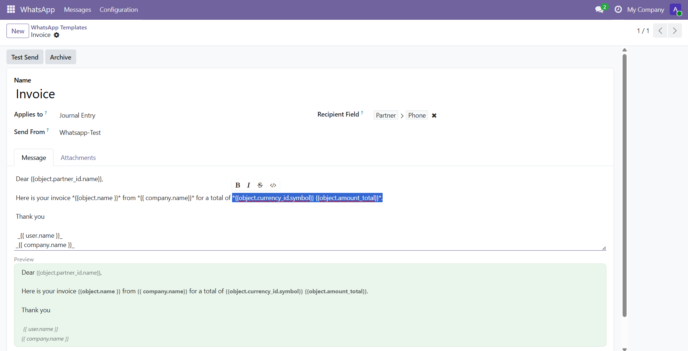
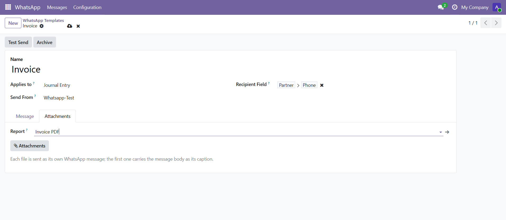
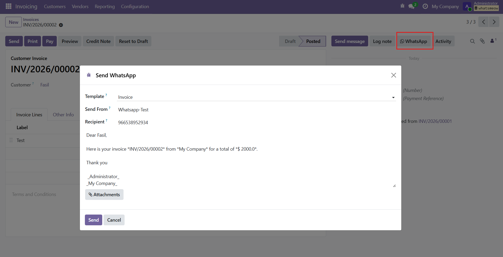

## Overview

**Whatsmeow Templates & Composer** (`whatsmeow_template`) lets you send templated WhatsApp messages from a record of any model. A template is a saved message body — interpolated against the record with `{{ object.name }}` placeholders — that can carry static attachments or a freshly generated PDF report. Operators launch it from the chatter's WhatsApp button, from a record's Action menu, or automation fires it through a **Send WhatsApp** server action.

Unlike Meta's Cloud API there is no template approval and no 24-hour session window, so a template here is simply a saved, field-interpolated message. Sending reuses the core connector's queue untouched: the composer only creates outgoing messages, so every send inherits the same pacing, warm-up caps, retries, opt-out checks, and idempotency for free — this module adds no transport code of its own.

### 🧩 Send From Any Model
Point a template at any Odoo model and it becomes available on that model's records — a sales order, an invoice, a contact, anything. The recipient number is resolved from the record, or from its contact, with no per-model configuration required.

### 🖊️ Placeholders, Attachments & PDF Reports
Write the body once with `{{ object.name }}`-style placeholders and it renders per record. Attach static files, or name a report and each recipient gets their own generated PDF — an invoice, a quotation — with the same filename the operator would see in the Print menu.

### ♻️ Rides the Core Queue
The composer creates ordinary outgoing messages and hands them to the core connector's paced queue. A bulk send is exactly the traffic that queue exists to smooth, so pacing, daily caps, opt-out enforcement, and retries all apply automatically.

## Features

### 📝 Templates for Any Model
Create a template against any model, with an optional default sending number. It is automatically published in that model's contextual **Action** menu, so operators can launch it from a record without touching the model's views.

### 🔤 Field Interpolation
The body is rendered against each record with `{{ object.name }}`, `{{ object.partner_id.name }}`, `{{ user.name }}`, and `{{ company.name }}` placeholders. WhatsApp's own formatting markers (`*`, `_`, `~`) that appear inside a rendered value are neutralised, so a customer name or order reference never accidentally italicises part of the message.

### 📎 Attachments & Generated Reports
Attach static files that go with every send, and/or name a report that is rendered to a PDF per record and attached — each with a sensible filename derived from the record. A configuration check makes sure the report actually belongs to the template's model.

### 🎯 Smart Recipient Resolution
Set an explicit recipient field path (e.g. `partner_id.phone`), or leave it blank to probe the record's own phone fields and then its contact's. Typos in a field path are caught while editing the template, not at send time when a batch is already going out.

### 🖼️ Composer With Live Preview
The composer opens preloaded with the template, shows the rendered message and resolved number for a single record, and lets the operator edit before sending. In batch mode each record renders its own body and resolves its own number, and records with no WhatsApp number are reported, never silently dropped.

### 🤖 "Send WhatsApp" Server Action
Wire a template into an automation with a **Send WhatsApp** server action — "on order confirmed, WhatsApp the customer" — with no code. It composes and queues for every record it runs on, by exactly the same rules as a hand-launched send.

### 📣 Send to One or Many
Launch a template on a single record from its chatter, or select many records in a list and send to all of them at once. Every message goes on the paced queue, so a batch to fifty contacts is spaced out rather than fired in a burst.

## Installation

This module extends the core connector, so **Whatsmeow WhatsApp Connector** (`whatsmeow`) must be installed first — with its gateway deployed and at least one session paired. Once the core module is in place, install this one from the Apps list like any other add-on.

## Configuration

Templates are managed under **WhatsApp → Configuration → Templates** (visible to WhatsApp Administrators).

- **Create a template**: Go to **WhatsApp → Configuration → Templates**, click **New**, and choose the model under **Applies to**.
- **Write the body**: Enter the message with `{{ object.field }}` placeholders; a live preview shows how it renders.
- **Set the sender and recipient**: Optionally pick a default **Send From** number, and set the **Recipient Field** path (or leave it blank to auto-probe the record and its contact).
- **Attach files or a report**: Add static **Attachments**, and/or pick a **Report** to generate a per-record PDF.
- **Wire an automation (optional)**: In Settings → Technical → Server Actions (or an automation rule), create a **Send WhatsApp** action, choose the model and the template, and trigger it however you like.

## Screenshots

The screenshots below show building a template, adding a report and attachments, and sending it from a record.

> Creating a template with a live rendered preview

> Attaching a generated PDF report and static files

> Launching a template from a record of any model

## Usage

### 🧱 Build a Template
**WORKFLOW · 01**
Create a reusable WhatsApp message for a model.

- Go to **WhatsApp → Configuration → Templates** and click **New**.
- Choose the model under **Applies to** and write the **body** with `{{ object.field }}` placeholders.
- Optionally set a **Send From** number, a **Recipient Field**, **Attachments**, and a **Report** for a per-record PDF.
- Save — the template is now available in that model's **Action** menu.

### 📤 Send From a Record
**WORKFLOW · 02**
Send a templated message to one contact.

- Open a record of the template's model and click the **WhatsApp** button on its chatter, or pick the template from the **Action** menu.
- Review the rendered **Message** and resolved **Recipient** in the composer, and edit if needed.
- Choose the **Send From** number if you have more than one, and click **Send** — the message joins the paced queue.

### 📦 Send in Bulk
**WORKFLOW · 03**
Message many records at once.

- Open a list view of the template's model and select the records you want to reach.
- From the **Action** menu, choose the template's **Send WhatsApp** entry.
- Click **Send**; each record renders its own message and resolves its own number, records without a number are reported, and the rest are queued and paced apart.

### ⚙️ Automate a Send
**WORKFLOW · 04**
Fire a template automatically when something happens.

- Create a **Send WhatsApp** server action (or automation rule) on the template's model and select the template.
- Trigger it however you like — on a status change, on a schedule, from a button.
- Every record the action runs on is composed and queued by the same rules as a manual send.

## Known Issues

This module only composes and queues; the actual delivery, pacing, and safeguards all live in the core connector.

> A template send obeys every core safeguard: a contact who has opted out is skipped, a number known not to be on WhatsApp is not sent to, and a session's daily cap still bounds how many of a large batch go out today. The rest stay queued for the following days — a big blast is spread out on purpose, not delivered all at once.

> Records with no resolvable WhatsApp number are skipped and reported (a notification and a server-log line), never silently dropped, so you always know a batch did not reach everyone.

## FAQ

**Do I need to get templates approved like on the WhatsApp Cloud API?**
No. There is no template approval and no 24-hour session window here. A template is just a saved, field-interpolated message you can send at any time.

**Which models can I send from?**
Any model. Point the template's **Applies to** at the model you want, and it becomes available on that model's records. The recipient number is resolved from the record or its contact automatically.

**Can I attach an invoice or quotation PDF?**
Yes. Name a **Report** on the template and each recipient gets their own generated PDF, with the same filename you would see in the Print menu. You can also add static attachments that go with every send.

**How does a bulk send avoid getting my number banned?**
The composer only creates outgoing messages and hands them to the core connector's paced queue, so a batch is spaced out and bounded by that session's warm-up and daily caps — it is not fired all at once.

**Can automation send a template without any code?**
Yes. Create a **Send WhatsApp** server action on the model, choose the template, and trigger it from an automation rule, a button, or a schedule.

## Changelog

### v19.0.1.0.0 — 2026-07-19
- Initial release
- Templates for any model, with `{{ object.field }}` placeholders and WhatsApp markup escaping
- Static attachments and per-record generated PDF reports
- Composer with live preview for single sends and batch mode for many records
- "Send WhatsApp" server action for no-code automation
- Sending reuses the core paced queue, inheriting pacing, caps, opt-out, and retries
